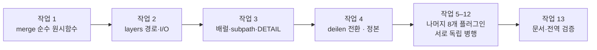

# Config Scope 구현 계획 (issue #103)

> 이 계획은 `/seiri:execute`로 실행한다. 각 구현 단위 전에 `/seiri:implement`를
> 로드하고, 완료를 주장하기 전에 `/seiri:verify`를 로드한다.

## 목표

플러그인 설정을 `user`(사용자 전역)와 `project`(프로젝트 로컬) 두 네임스페이스로
분리해 각각 관리·편집할 수 있게 하고, 읽을 때는 **project가 user를 재정의하는**
단일 병합 결과를 일관된 인터페이스로 제공한다. 웹 설정 UI는 두 네임스페이스를
구분해 편집할 수 있는 도구를 제공한다.

병합 규칙은 **재귀 deep merge, 배열은 교체**다. 적용 범위는 단일 `config.json`을
가진 플러그인 **9개 전부**다.

**이번 작업의 중심은 config의 작성과 병합 읽기다.** 신규 워크스페이스는 만들지
않는다. 설정 페이지의 스코프 UI는 각 플러그인이 자기 페이지에서 구현하고,
브라우저와 공유하는 것은 순수 config 로직(`config-scope/merge`)뿐이다. 스타일이나
컴포넌트를 공유할 필요가 생기면 `shared/ui`를 별도 이슈로 세운다.

## 전역 제약 (모든 작업이 상속한다)

- 언어: TypeScript, ESM, Node ≥ 20. import 경로는 `.js` 확장자를 붙인다.
- `shared/cross-platform`은 `private: true` 워크스페이스 패키지다. **외부 npm
  의존성을 추가하지 않는다.** 새 코드는 Node 내장 모듈과 기존 내부 모듈만 쓴다.
- 공유 모듈은 **스키마에 무지하다**. zod는 각 플러그인에 남는다. 공유 계층은
  `Record<string, unknown>`을 읽고 병합해 돌려주고, 검증은 호출자가 한다.
- 레이어 읽기는 **절대 throw하지 않는다.** 파일 부재는 정상 상태(`null`), 손상은
  `null` + `warnings` 항목이다. 세션을 죽이지 않는다.
- 쓰기는 `writeFileAtomicallySync` / `ensureDirectorySync`(`@ogham/cross-platform/filesystem`)를
  경유한다. `node:fs`를 직접 호출하지 않는다.
- FCA: 새 fractal 디렉터리는 `INTENT.md`(≤ 50줄) + `index.ts`(named re-export만)를
  가진다. 형제 모듈은 형제의 진입점(`../merge`)으로 import하고 내부 파일을
  직접 참조하지 않는다. 같은 모듈 내부 파일끼리는 직접 import한다.
- 스펙 파일당 케이스 **15개 이하**. 초과하면 파일을 분리한다. 커버리지를 줄여
  상한을 맞추지 않는다.
- 훅 도달 코드는 배럴을 거치지 않고 **목적별 subpath**를 직접 import한다
  (루트 `CLAUDE.md`의 번들 규칙). 훅 변경 뒤 해당 패키지의 번들 크기 가드를 돌린다.
- `plugins/*/public/`, `.codex-plugin/`, 루트 `plugin.json`은 생성물이다. 원본
  (`src/mcp/pages/**`, 매니페스트)을 고치고 빌드 스크립트로 재생성한다.

## 현재 상태 (측정값)

| 플러그인       | 현재 config 위치                          | 현재 레이어 | 프로젝트 루트 기준 | 설정 페이지 |
| -------------- | ----------------------------------------- | ----------- | ------------------ | ----------- |
| `atlassian`    | `pluginCache('atlassian')/config.json`    | user        | —                  | 있음        |
| `cennad`       | `CENNAD_HOME/config.json`                 | user        | —                  | 있음        |
| `deilen`       | `DEILEN_HOME/config.json`                 | user        | —                  | 있음        |
| `entrez`       | `pluginCache('entrez')/config.json`       | user        | —                  | 있음        |
| `r-statistics` | `R_STATISTICS_HOME/config.json`           | user        | —                  | 없음        |
| `filid`        | `<gitRoot>/.filid/config.json`            | project     | `resolveGitRoot()` | 있음        |
| `seiri`        | `<repoRoot>/.seiri/config.json`           | project     | `findRepoRoot()`   | 있음        |
| `imbas`        | `<cwd>/.imbas/config.json`                | project     | 인자 `cwd`         | 있음        |
| `maencof-lens` | `<projectRoot>/.maencof-lens/config.json` | project     | 인자 `projectRoot` | 없음        |

**핵심 결과: 데이터 마이그레이션이 필요 없다.** 두 레이어의 물리적 위치가 이미
저장소에 모두 존재하고, 각 플러그인이 그중 하나만 쓰고 있다. 전환 후 기존 파일은
자기 자리를 그대로 유지하고 비어 있는 반대편 레이어가 추가될 뿐이다.

- `maencof`, `prawf`는 범위 밖이다. `maencof`는 단일 `config.json`이 없고
  `autonomy-config.json` / `dialogue-config.json` / `vault-commit.json`으로
  쪼개져 있으며 설정 페이지도 없다. `prawf`는 config 자체가 없다. 이 둘을
  포함하려면 별도 이슈로 파일별 레이어 설계를 먼저 해야 한다.

## 설계

### 레이어 좌표

- **user** — `pluginCache(<plugin>)/config.json`
  → `~/.claude/plugins/<plugin>/config.json` (호스트 인지: codex는 `~/.codex`)
- **project** — `<projectRoot>/.<plugin>/config.json`

`projectRoot`는 **공유 계층이 해석하지 않는다.** 각 플러그인이 지금 쓰는 앵커
규칙(`resolveGitRoot`, `findRepoRoot`, 인자 `cwd`)을 그대로 유지한 채 해석된
절대 경로를 넘긴다. 앵커 규칙을 공유 계층으로 옮기면 4개 플러그인의 기존 동작이
조용히 바뀐다.

### 우선순위

```
defaults  <  user  <  project        (일반)
defaults  <  user  <  project  <  runtime.json     (seiri — 세션 밸브가 최상위)
```

### 병합 규칙

- 양쪽이 plain object → 키 단위 재귀
- 그 외 (배열 / 원시값 / `null`) → override(project)가 통째로 교체
- override에 없는 키 → base(user) 값 유지
- override의 명시적 `null` → 값으로 취급해 교체 (JSON에 `undefined`는 없다)
- `__proto__` / `constructor` / `prototype` 키 → 버린다 (프로토타입 오염 차단)

**배열을 인덱스 단위로 병합하지 않는 이유**: `["basic","auth","extra"]` 위에
`["advanced"]`를 인덱스 병합하면 `["advanced","auth","extra"]`가 되어 project
레이어에서 목록을 **줄일 방법이 없어진다.** 통째 교체는 목록을 줄이는 유일한
안이고, 늘리고 싶으면 project에 전체 목록을 쓰면 된다.

구현은 `albatrion/packages/winglet/common-utils`의 `merge`를 참조하되 배열
처리·불변성·키 차단 세 지점이 다르다. 근거는 작업 1-3의 표에 있다.

### 검증 지점

레이어 각각은 스키마 검증하지 않는다. **병합 결과 하나만** 각 플러그인의 기존
zod 스키마로 검증한다. project 레이어는 부분 문서(재정의된 키만)이므로 단독으로는
strict 스키마를 통과할 수 없다 — 부분 스키마를 새로 만들지 않는 이유다.

설정 페이지 저장 시에도 같은 원칙을 쓴다: 제출된 레이어를 저장된 반대편 레이어
위에 병합한 **미리보기 결과**를 strict 스키마로 검증하고, 통과할 때만 해당
레이어 파일을 쓴다.

### project 레이어의 커밋 정책

| 플러그인                                  | project `config.json`   | 처리                                              |
| ----------------------------------------- | ----------------------- | ------------------------------------------------- |
| `seiri`, `filid`, `imbas`, `maencof-lens` | 커밋 대상 (팀 기준선)   | 기존 그대로. `.gitignore` 추가하지 않는다.        |
| `atlassian`, `entrez`                     | 커밋 금지 (식별자 포함) | 디렉터리 생성 시 `.gitignore`(`config.json`) 동봉 |
| `cennad`, `deilen`, `r-statistics`        | 사용자 판단             | `.gitignore` 없음. 문서로만 안내                  |

`atlassian`/`entrez`의 `credentials.json`은 **user 레이어 전용**이다. 이번 변경은
`config.json`만 다룬다.

### 웹 UI 계약

```
GET  /api/config
  → { ok: true, state: ConfigScopeState }

POST /api/config
  body { scope: "user" | "project", config: Record<string, unknown> }
  → { ok: true, state: ConfigScopeState } | { ok: false, message, errors? }
```

- `scope: "user"` — 전체 필드를 담은 완결 문서를 보낸다.
- `scope: "project"` — **재정의된 키만** 담는다. 키를 빼는 것이 "재정의 해제"다.
  별도 clear 라우트를 두지 않는다.
- 응답은 항상 갱신된 `ConfigScopeState`를 돌려줘 클라이언트가 재조회 없이
  배지를 다시 그린다.

UI는 상단 `User / Project` 토글 하나, 각 필드에 `상속됨(user)` / `재정의됨` 배지와
`재정의 해제` 버튼을 둔다. Project 스코프에서만 배지가 나타난다.

**화면은 각 플러그인이 직접 만든다.** 공유 UI 패키지를 두지 않는다 — 이번 범위는
config의 작성과 병합 읽기이고, DOM 코드는 `cross-platform`의 경계 밖이다.
브라우저가 공유하는 것은 순수 config 로직뿐이다: 설정 페이지는
`@ogham/cross-platform/config-scope/merge`에서 `clearConfigPaths`와
`listOverriddenPaths`만 가져와 "재정의된 키만" 담은 부분 문서를 만든다.

8곳이 어긋나지 않게 하는 장치는 두 가지다. 위의 wire 계약과 아래 DOM 규약을
`configScope/DETAIL.md`에 못박고, 작업 4(`deilen`)를 그 정본 구현으로 삼는다.

| 요소             | 규약                                                                |
| ---------------- | ------------------------------------------------------------------- |
| 스코프 토글      | `<input name="config_scope" value="user" \| "project">`             |
| 필드 식별        | 필드 래퍼에 `data-config-path="renderers.mermaid"` (dot path)       |
| 상속 상태        | 같은 요소에 `data-scope-state="inherited" \| "overridden" \| "own"` |
| 배지 · 해제 버튼 | 표시 여부는 CSS가 `[data-scope-state=...]`로 결정                   |

`project` 레이어를 쓸 수 없을 때(`paths.project === null`) Project 라디오는
`disabled`이고 이유를 한 줄 표시한다.

## 모듈 구조

```
shared/cross-platform/src/configScope/          fractal
├── INTENT.md
├── index.ts                                    배럴 (named re-export만)
├── types/                                      organ
│   └── types.ts
├── merge/                                      fractal — 순수, node import 0개
│   ├── INTENT.md
│   ├── index.ts
│   ├── mergeConfigLayers.ts
│   ├── listOverriddenPaths.ts
│   ├── clearConfigPaths.ts
│   ├── utils/
│   │   └── isPlainObject.ts
│   └── __tests__/
└── layers/                                     fractal — 파일 I/O
    ├── INTENT.md
    ├── index.ts
    ├── resolveConfigLayers.ts
    ├── readConfigLayers.ts
    ├── writeConfigLayer.ts
    ├── buildConfigScopeState.ts
    └── __tests__/
```

신규 워크스페이스는 만들지 않는다. 이번 작업의 범위는 **config의 작성과 병합
읽기**이고, 화면은 각 플러그인의 몫이다.

`merge/`가 node 내장을 import하지 않는 것은 계약이다. 설정 페이지 번들(브라우저)이
`@ogham/cross-platform/config-scope/merge`를 그대로 번들할 수 있어야 하고, 훅
번들이 파일 I/O 그래프를 끌어오지 않아야 한다. `__tests__/`에 이 금지를 검사하는
케이스를 둔다.

**브라우저와 공유하는 것은 config 로직뿐이다.** 설정 페이지는
`config-scope/merge`에서 `clearConfigPaths` / `listOverriddenPaths`만 가져다
"재정의된 키만" 담은 부분 문서를 만든다. 토글·배지·폼 채우기는 각 플러그인이
자기 페이지에서 구현한다 — DOM 코드는 `cross-platform`의 경계 밖이고
(이 패키지는 스스로를 "OS 경로·파일 시스템·프로세스 실행 호환성 계층"으로
선언한다), 별도 UI 패키지를 세우는 것은 이번 범위 밖이다.

8곳이 어긋나지 않게 하는 장치는 패키지가 아니라 **문서와 정본 구현**이다.
`configScope/DETAIL.md`가 wire 계약과 스코프 의미를 못박고, 작업 4(`deilen`)가
그것을 구현한 정본이다. 나머지 7곳은 그 구조를 따른다. 스타일까지 공유할
필요가 생기면 그때 `shared/ui`를 별도 이슈로 세운다.

---

## 작업 1 — `configScope/merge` 순수 원시 함수

**산출물**: node 의존 없는 병합·경로열거·삭제 함수 3개와 단위 테스트.

### 1-1. `src/configScope/types/types.ts` 생성

```ts
/** 설정 네임스페이스. project가 user를 재정의한다. */
export type ConfigScope = "user" | "project";

/** 두 레이어 파일의 절대 경로. project는 프로젝트 루트를 모를 때 null. */
export interface ConfigLayerPaths {
  readonly user: string;
  readonly project: string | null;
}

/** 디스크에서 읽은 두 레이어의 원문. 부재/손상은 모두 null. */
export interface ConfigLayerDocuments {
  readonly user: Record<string, unknown> | null;
  readonly project: Record<string, unknown> | null;
  readonly warnings: readonly string[];
}

/** 설정 페이지 GET 응답 본문이자 병합 소비자의 단일 조회 결과. */
export interface ConfigScopeState {
  readonly paths: ConfigLayerPaths;
  readonly layers: {
    readonly user: Record<string, unknown> | null;
    readonly project: Record<string, unknown> | null;
  };
  /** user 위에 project를 deep merge한 결과. 호출자가 스키마 검증한다. */
  readonly effective: Record<string, unknown>;
  /** project 레이어가 값을 가진 리프의 dot path 목록. */
  readonly overridden: readonly string[];
  readonly warnings: readonly string[];
}

export interface ResolveConfigLayersOptions {
  /** `pluginCache()` 키이자 기본 project 디렉터리 이름의 어간. */
  readonly pluginName: string;
  /** 이미 해석된 절대 경로. 알 수 없으면 null → project 레이어 비활성. */
  readonly projectRoot: string | null;
  /** 기본값 `"config.json"`. */
  readonly fileName?: string;
  /** 기본값 `` `.${pluginName}` ``. maencof-lens처럼 다른 이름을 쓰는 곳용. */
  readonly projectDirName?: string;
  /** 기본값 `pluginCache(pluginName)`. cennad의 `CENNAD_CONFIG_PATH`용. */
  readonly userDir?: string;
}
```

### 1-2. `src/configScope/merge/utils/isPlainObject.ts` 생성

**출처**: `albatrion/packages/winglet/common-utils/src/utils/filter/isPlainObject.ts`
를 그대로 가져온다. 계획 초안의 2줄짜리 판정보다 견고하다 — `Object.create(null)`
로 만든 객체(프로토타입 체인이 한 단 더 있는 경우)를 통과시키고,
`Object.prototype.toString` 태그로 `Math` / `JSON` 같은 exotic 객체를 걸러낸다.

```ts
/**
 * 배열도 null도 클래스 인스턴스도 아닌 순수 객체인지.
 *
 * 판정 3단: (1) object이고 falsy가 아님 (2) 프로토타입이 null이거나
 * `Object.prototype`이거나, 그 프로토타입이 null (= `Object.create(null)` 계열)
 * (3) toString 태그가 `'[object Object]'`.
 *
 * 원본: albatrion/packages/winglet/common-utils/src/utils/filter/isPlainObject.ts
 */
export function isPlainObject(
  value: unknown,
): value is Record<string, unknown> {
  if (!value || typeof value !== "object") return false;

  const proto = Object.getPrototypeOf(value) as object | null;
  const hasObjectPrototype =
    proto === null ||
    proto === Object.prototype ||
    Object.getPrototypeOf(proto) === null;
  if (!hasObjectPrototype) return false;

  return Object.prototype.toString.call(value) === "[object Object]";
}
```

배열은 `Object.prototype.toString.call([])`이 `'[object Array]'`라 3단에서
탈락한다. `Array.isArray` 분기를 따로 두지 않아도 되는 이유다.

**주의**: 이 가드는 `Object.prototype` 자체에도 `true`를 준다 (프로토타입이
null이고 태그가 `'[object Object]'`). 1-3의 프로토타입 오염 차단이 필요한
직접적인 이유다.

### 1-3. `src/configScope/merge/mergeConfigLayers.ts` 생성

**참조**: `albatrion/packages/winglet/common-utils/src/utils/object/merge.ts`.
재귀 구조와 `isPlainObject` 가드를 가져오되, 세 지점은 이 용도에 맞게 바꾼다.
아래는 원본 로직을 그대로 복제해 실행한 **측정 결과**이며, 추측이 아니다.

| 원본 동작 (측정)                                                                                                                    | 이 용도에서의 문제                                                                                                                                | 이 계획의 결정                                                              |
| ----------------------------------------------------------------------------------------------------------------------------------- | ------------------------------------------------------------------------------------------------------------------------------------------------- | --------------------------------------------------------------------------- |
| 배열을 **인덱스 단위**로 병합. `{f:["basic","auth","extra"]}` + `{f:["advanced"]}` → `{f:["advanced","auth","extra"]}`              | project 레이어에서 목록을 **줄일 수 없다**. user의 꼬리가 살아남는다. (원본 JSDoc은 concat이라 적혀 있으나 코드·테스트·실측 모두 인덱스 병합이다) | **배열은 통째로 교체.** 사용자가 정한 규칙이자 목록 축소가 가능한 유일한 안 |
| `target`을 **in-place 변형**하고 그대로 반환 (`merge(base, o) === base` 확인)                                                       | `ConfigScopeState`가 `layers.user`와 `effective`를 동시에 노출한다. 병합이 `layers.user`를 오염시켜 UI가 잘못된 "상속값"을 그린다                 | **불변.** 새 객체만 반환하고 입력 둘 다 건드리지 않는다                     |
| `JSON.parse('{"__proto__":{"polluted":"yes"}}')`를 병합하면 **`Object.prototype`이 실제로 오염됨** (`({}).polluted === "yes"` 확인) | 입력이 디스크의 JSON 파일이다. 클론한 저장소의 `.filid/config.json` 하나로 프로세스 전역이 오염된다 (원본 JSDoc도 이 방어를 호출자 책임으로 명시) | **`__proto__` / `constructor` / `prototype` 키를 건너뛴다**                 |

오염이 성립하는 경로: `victim["__proto__"]`는 `Object.prototype`을 돌려주고,
1-2의 `isPlainObject`는 그것을 `true`로 판정한다. 그래서 원본의
`isPlainObject(targetValue) ? merge(targetValue, sourceValue)` 분기가
`merge(Object.prototype, {...})`가 되어 전역에 키를 심는다. 우리는 얕은 복사
기반이라 대입 대상이 `Object.prototype`이 되지는 않지만, `{...base}` 이후
`merged["__proto__"] = ...` 대입 자체가 프로토타입 설정자를 때린다. 키 차단이
유일하게 확실한 방어다.

`undefined` 처리(`targetValue === undefined || sourceValue !== undefined`)는
가져오지 않는다. 입력이 `JSON.parse` 산출물이라 `undefined` 값이 존재할 수 없고,
있지도 않은 경우를 위한 분기는 읽는 사람에게 없는 규칙을 암시한다.

```ts
import { isPlainObject } from "./utils/isPlainObject.js";
import { FORBIDDEN_KEYS } from "./utils/forbiddenKeys.js";

/**
 * user 레이어 위에 project 레이어를 재귀 병합한다.
 *
 * 규칙: 양쪽이 plain object인 키만 재귀한다. 배열·원시값·`null`은 override가
 * 통째로 교체한다 — 배열을 인덱스 단위로 병합하면 project에서 목록을 줄일 수
 * 없다.
 *
 * 입력을 변형하지 않는다. 호출자가 `layers.user`와 `effective`를 동시에
 * 들고 있으므로 in-place 병합은 UI가 보여줄 "상속값"을 파괴한다.
 *
 * `__proto__` / `constructor` / `prototype` 키는 버린다. 입력은 신뢰할 수 없는
 * 디스크의 JSON이다. 구조는 albatrion `common-utils`의 `merge`를 참조했고,
 * 배열·불변성·키 차단 셋이 그와 다르다.
 */
export function mergeConfigLayers(
  base: Record<string, unknown> | null,
  override: Record<string, unknown> | null,
): Record<string, unknown> {
  const merged: Record<string, unknown> = {};
  if (base !== null) copySafeKeys(base, merged);
  if (override === null) return merged;

  for (const key of Object.keys(override)) {
    if (FORBIDDEN_KEYS.has(key)) continue;
    const overrideValue = override[key];
    const baseValue = merged[key];
    merged[key] =
      isPlainObject(baseValue) && isPlainObject(overrideValue)
        ? mergeConfigLayers(baseValue, overrideValue)
        : overrideValue;
  }
  return merged;
}
```

`copySafeKeys(source, into)`는 `FORBIDDEN_KEYS`를 뺀 own key만 옮기는 헬퍼다.
본문 4줄이라 같은 파일에 비공개로 둘 수 있다 (seiri_function-boundaries §3의
헬퍼 2개·각 8줄 예산 안).

`src/configScope/merge/utils/forbiddenKeys.ts`:

```ts
/**
 * 병합에서 버리는 키. 대입 대상이 되면 프로토타입 체인을 건드린다.
 *
 * `Set`으로 두는 이유는 조회 때문이 아니라(3개뿐이다) 목록이 한 곳에만
 * 존재하게 하기 위해서다. `clearConfigPaths`도 이 집합을 쓴다.
 */
export const FORBIDDEN_KEYS: ReadonlySet<string> = new Set([
  "__proto__",
  "constructor",
  "prototype",
]);
```

`readConfigLayers`는 이 키를 **제거하지 않는다.** 레이어 원문은 디스크에 있는
그대로 UI에 보여준다. 걸러내는 지점은 병합 한 곳이다 — 두 곳에서 거르면
"설정 파일에 있는데 왜 안 먹지"를 두 배로 어렵게 만든다. 대신
`readConfigLayers`가 해당 키를 발견하면 `warnings`에 한 줄 남긴다.

### 1-4. `src/configScope/merge/listOverriddenPaths.ts` 생성

project 레이어에서 값을 가진 **리프**의 dot path를 열거한다. 리프는 plain object가
아닌 값, 또는 빈 plain object다. 배열은 리프다(교체 단위이므로).

`FORBIDDEN_KEYS`는 열거하지 않는다. `mergeConfigLayers`가 버리는 키라 재정의로
셀 수 없고, 열거하면 UI가 "재정의됨" 배지를 띄운 뒤 `clearConfigPaths`에 그
path를 넘기게 된다 — 1-5의 대입 경로로 오염이 되돌아온다.

```ts
import { isPlainObject } from "./utils/isPlainObject.js";
import { FORBIDDEN_KEYS } from "./utils/forbiddenKeys.js";

export function listOverriddenPaths(
  override: Record<string, unknown> | null,
): readonly string[] {
  if (override === null) return [];
  const paths: string[] = [];
  const walk = (node: Record<string, unknown>, prefix: string): void => {
    for (const [key, value] of Object.entries(node)) {
      if (FORBIDDEN_KEYS.has(key)) continue;
      const path = prefix === "" ? key : `${prefix}.${key}`;
      if (isPlainObject(value) && Object.keys(value).length > 0)
        walk(value, path);
      else paths.push(path);
    }
  };
  walk(override, "");
  return paths;
}
```

### 1-5. `src/configScope/merge/clearConfigPaths.ts` 생성

dot path 목록을 지운 새 문서를 반환한다. 삭제로 비어버린 상위 객체는 함께
제거한다 — 빈 껍데기가 남으면 `listOverriddenPaths`가 그것을 리프로 세어
"재정의됨" 배지가 사라지지 않는다.

```ts
import { removePath } from "./utils/removePath.js";

/**
 * dot path 목록을 지운 새 문서를 반환한다. 아무것도 지워지지 않으면 입력
 * 참조를 그대로 돌려준다 — 이 함수는 입력을 변형하지 않으므로 안전하다.
 */
export function clearConfigPaths(
  source: Record<string, unknown>,
  paths: readonly string[],
): Record<string, unknown> {
  let result = source;
  for (const path of paths) result = removePath(result, path.split("."));
  return result;
}
```

`src/configScope/merge/utils/removePath.ts` (본문 12줄이라 별도 파일 —
seiri_function-boundaries §3의 헬퍼 8줄 예산 초과):

```ts
import { FORBIDDEN_KEYS } from "./forbiddenKeys.js";
import { isPlainObject } from "./isPlainObject.js";

export function removePath(
  node: Record<string, unknown>,
  segments: readonly string[],
): Record<string, unknown> {
  const [head, ...rest] = segments;
  // hasOwn이어야 한다. `in`은 프로토타입 체인을 보므로 `"constructor" in {}`가
  // true가 되어 없는 키를 지우려 든다.
  if (head === undefined || !Object.hasOwn(node, head)) return node;
  if (FORBIDDEN_KEYS.has(head)) return node;
  const next = { ...node };
  if (rest.length === 0) {
    delete next[head];
    return next;
  }
  const child = next[head];
  if (!isPlainObject(child)) return node;
  const pruned = removePath(child, rest);
  if (Object.keys(pruned).length === 0) delete next[head];
  else next[head] = pruned;
  return next;
}
```

`FORBIDDEN_KEYS` 차단이 여기에도 필요한 이유는 `next[head] = pruned` 대입
때문이다. `head`가 `__proto__`면 이 한 줄이 프로토타입 설정자를 때린다.
`clearConfigPaths`는 공개 API라 호출자를 열거할 수 없으므로, 1-4에서 이미
막았더라도 신뢰 경계에서 다시 막는다 (seiri_reuse-first §2).

### 1-6. `src/configScope/merge/index.ts` 생성

```ts
export { clearConfigPaths } from "./clearConfigPaths.js";
export { listOverriddenPaths } from "./listOverriddenPaths.js";
export { mergeConfigLayers } from "./mergeConfigLayers.js";
export { FORBIDDEN_KEYS } from "./utils/forbiddenKeys.js";
export { isPlainObject } from "./utils/isPlainObject.js";
```

`isPlainObject`와 `FORBIDDEN_KEYS`는 `utils/`에 있지만 배럴이 이름으로
재노출한다. `layers/`가 둘 다 필요하고(2-2), 형제 모듈은 내부 파일이 아니라
진입점으로 들어와야 하기 때문이다.

### 1-7. `src/configScope/merge/INTENT.md` 생성 (≤ 50줄)

`## Purpose` / `## Structure` / `## Conventions` / `## Boundaries`
(`### Always do` / `### Ask first` / `### Never do`) / `## Dependencies`.
`Never do`에 **"node 내장 모듈을 import하지 않는다 — 이 모듈은 브라우저 설정
페이지 번들과 훅 번들에 동시에 들어간다"**를 명시한다.

### 1-8. 테스트

`src/configScope/merge/__tests__/mergeConfigLayers.test.ts` (14 케이스)

- 양쪽 null → `{}`
- base만 있음 → base 복사본 (원본 불변)
- override만 있음 → override 복사본
- 최상위 원시값 교체
- 중첩 객체 키 단위 병합 (`{a:{x:1,y:2}}` + `{a:{y:9}}` → `{a:{x:1,y:9}}`)
- **배열은 통째로 교체 — 짧은 배열이 긴 배열을 덮는다.**
  `{v:[1,2,3]}` + `{v:[9]}` → `{v:[9]}`. 인덱스 병합이면 `[9,2,3]`이 되므로
  이 케이스가 두 전략을 가르는 오라클이다. 참조 구현과 갈리는 지점이라
  테스트에 그 이유를 주석으로 남긴다.
- 객체 → 배열 교체
- 객체 → 원시값 교체
- 명시적 `null`이 base 값을 교체
- 3단 중첩 재귀
- 입력 객체 비변형 확인 (base/override 모두). 반환값이 `base`와 다른 참조인지도
  단언한다 (`expect(merged).not.toBe(base)`).
- **`__proto__` 오염 차단**: `JSON.parse('{"__proto__":{"polluted":"x"}}')`를
  override로 넘긴 뒤 `({} as Record<string, unknown>).polluted`가
  `undefined`이고, 결과에도 `polluted`가 없음을 단언한다. 리터럴이 아니라
  **`JSON.parse`로 만들어야 한다** — 객체 리터럴의 `__proto__`는 own key가
  아니라 프로토타입 설정 문법이라 이 취약점을 재현하지 못한다.
- `constructor` 키가 base·override 양쪽에서 버려짐
- base 쪽에만 `__proto__`가 있어도 결과에 실리지 않음

`src/configScope/merge/__tests__/isPlainObject.test.ts` (≤ 15 케이스)

- 객체 리터럴 → true
- `Object.create(null)` → true
- 배열 → false
- `null` / `undefined` / 숫자 / 문자열 → false
- `new Date()` → false
- 클래스 인스턴스 → false
- `Math`, `JSON` → false (toString 태그로 걸러짐)
- `Object.prototype` → **true** (1-3의 키 차단이 필요한 이유. 이 결과가
  의외라는 점을 주석으로 남긴다)

`src/configScope/merge/__tests__/listOverriddenPaths.test.ts` (≤ 15 케이스)

- null → `[]`
- 최상위 리프
- 중첩 dot path
- 배열은 리프
- 빈 객체는 리프
- `null` 값도 리프
- 형제 다수

`src/configScope/merge/__tests__/clearConfigPaths.test.ts` (≤ 15 케이스)

- 존재하지 않는 path → 원본 동일
- 최상위 키 삭제
- 중첩 키 삭제 후 상위 유지 (형제가 남는 경우)
- 중첩 키 삭제 후 빈 상위 제거
- 3단 중첩에서 연쇄 제거
- 복수 path 동시 삭제
- 입력 비변형 확인
- `"constructor"` path → 원본 동일 (`in` 대신 `hasOwn`을 쓰는지의 오라클.
  `in`이면 `Object.prototype.constructor`가 잡혀 없는 키를 지우려 든다)
- `"__proto__"` path → 원본 동일이고 `({} as Record<string, unknown>).polluted`가
  `undefined`

`src/configScope/merge/__tests__/pureImports.test.ts` (1 케이스)

- `merge/` 아래 모든 `.ts`를 읽어 `node:` 접두 import가 0건임을 단언한다.
  `readdirSync` + 정규식. 이 테스트가 브라우저 번들 가능성의 오라클이다.

**검증**: `yarn crossPlatform test:run`

---

## 작업 2 — `configScope/layers` 경로 해석 · 읽기 · 쓰기 · 상태 빌더

**산출물**: 두 레이어 파일의 좌표를 정하고, 읽고, 쓰고, `ConfigScopeState`를
조립하는 함수 4개와 테스트.

작업 1의 `mergeConfigLayers` / `listOverriddenPaths`를 **형제 진입점**
`../merge/index.js`로 소비한다.

### 2-1. `src/configScope/layers/resolveConfigLayers.ts`

```ts
// 형제 모듈은 진입점으로 import한다 (filesystem/mutation/writeFileAtomicallySync.ts
// 가 `../../paths/index.js`를 쓰는 것과 같은 규칙).
import { pluginCache, portableJoin } from "../../paths/index.js";
import type {
  ConfigLayerPaths,
  ResolveConfigLayersOptions,
} from "../types/types.js";

/**
 * 두 레이어 파일의 절대 경로를 정한다. 파일 존재 여부는 보지 않는다 —
 * 좌표 계산과 디스크 조회는 분리된 관심사다.
 *
 * `projectRoot`는 호출자가 이미 해석해 넘긴다. 플러그인마다 앵커 규칙이
 * 달라(git root / repo root / 인자 cwd) 여기서 통일하면 기존 동작이 바뀐다.
 */
export function resolveConfigLayers(
  options: ResolveConfigLayersOptions,
): ConfigLayerPaths {
  const fileName = options.fileName ?? "config.json";
  const userDir = options.userDir ?? pluginCache(options.pluginName);
  const projectDirName = options.projectDirName ?? `.${options.pluginName}`;
  return {
    user: portableJoin(userDir, fileName),
    project:
      options.projectRoot === null
        ? null
        : portableJoin(options.projectRoot, projectDirName, fileName),
  };
}
```

### 2-2. `src/configScope/layers/readConfigLayers.ts`

`readUtf8FileIfExistsSync`로 각 레이어를 읽고 `JSON.parse`한다. 부재는 `null`,
파싱 실패·비객체는 `null` + `warnings` 한 줄. 절대 throw하지 않는다.

```ts
import { readUtf8FileIfExistsSync } from "../../filesystem/index.js";
import { isPlainObject } from "../merge/index.js";
import type { ConfigLayerDocuments, ConfigLayerPaths } from "../types/types.js";

export function readConfigLayers(
  paths: ConfigLayerPaths,
): ConfigLayerDocuments {
  const warnings: string[] = [];
  return {
    user: readLayer(paths.user, warnings),
    project: readLayer(paths.project, warnings),
    warnings,
  };
}
```

> `isPlainObject`는 현재 `merge/utils/`의 내부 파일이다. `layers/`가 쓰려면
> `merge/index.ts`가 이를 named re-export해야 한다. 작업 1의 6단계 배럴에
> `export { isPlainObject } from "./utils/isPlainObject.js";`를 추가한다.

> `readLayer`(경로 null 처리 + read + parse + warning)는 본문이 8줄을 넘으므로
> `layers/utils/readLayer.ts`로 분리한다.

`readLayer`는 문서를 **정화하지 않는다.** 레이어 원문은 디스크에 있는 그대로
`ConfigScopeState.layers`에 실려 UI가 파일 내용을 그대로 보여준다. 걸러내는
지점은 `mergeConfigLayers` 한 곳뿐이다 — 두 곳에서 거르면 "파일에는 있는데 왜
안 먹지"의 원인이 두 배로 흩어진다.

다만 최상위든 중첩이든 `FORBIDDEN_KEYS` 중 하나를 own key로 발견하면
`warnings`에 한 줄 남긴다. 사용자가 그 키를 의도적으로 썼을 리 없으므로,
조용히 무시하는 것보다 "이 키는 무시했다"고 말하는 편이 낫다.
`merge/index.ts`가 `FORBIDDEN_KEYS`를 재노출해야 하며, 탐지 함수는
`layers/utils/findForbiddenKeys.ts`에 둔다.

### 2-3. `src/configScope/layers/writeConfigLayer.ts`

```ts
import {
  ensureDirectorySync,
  writeFileAtomicallySync,
} from "../../filesystem/index.js";
import { portableDirname } from "../../paths/index.js";
import type { ConfigLayerPaths, ConfigScope } from "../types/types.js";

/**
 * 한 레이어 파일을 원자적으로 교체하고 쓴 경로를 반환한다.
 *
 * `scope: "project"`인데 프로젝트 루트를 모르면 던진다 — 조용히 user에
 * 쓰면 사용자가 의도한 것과 다른 파일이 바뀐다.
 */
export function writeConfigLayer(
  paths: ConfigLayerPaths,
  scope: ConfigScope,
  document: Record<string, unknown>,
  options?: { readonly fileMode?: number },
): string {
  const target = scope === "user" ? paths.user : paths.project;
  if (target === null)
    throw new Error(
      "Cannot write the project config layer: no project root was resolved.",
    );
  ensureDirectorySync(portableDirname(target));
  writeFileAtomicallySync(target, `${JSON.stringify(document, null, 2)}\n`, {
    fileMode: options?.fileMode,
  });
  return target;
}
```

`portableDirname`은 `src/paths/compat/portableDirname.ts`에 이미 있고
`paths/index.ts`가 재노출한다 (`filesystem/mutation/writeFileAtomicallySync.ts`가
같은 경로로 쓰고 있다). 새로 만들지 않는다.

`fileMode`는 `atlassian` / `entrez`가 `0o600`을 유지하기 위해 필요하다.
`writeFileAtomicallySync`의 `AtomicWriteOptions`가 이미 `fileMode`를 받으므로
그대로 흘려보낸다.

### 2-4. `src/configScope/layers/buildConfigScopeState.ts`

```ts
export function buildConfigScopeState(
  paths: ConfigLayerPaths,
): ConfigScopeState {
  const documents = readConfigLayers(paths);
  return {
    paths,
    layers: { user: documents.user, project: documents.project },
    effective: mergeConfigLayers(documents.user, documents.project),
    overridden: listOverriddenPaths(documents.project),
    warnings: documents.warnings,
  };
}
```

이것이 **런타임 소비자와 설정 페이지가 공유하는 단일 조회 지점**이다. 런타임은
`state.effective`만 꺼내 스키마 검증하고, 설정 페이지는 전체를 JSON으로 내보낸다.

### 2-5. `src/configScope/layers/index.ts` + `INTENT.md`

`INTENT.md`의 `### Never do`에 "레이어 읽기에서 throw하지 않는다", "프로젝트
루트를 스스로 추측하지 않는다"를 명시한다.

### 2-6. 테스트

`src/configScope/layers/__tests__/resolveConfigLayers.test.ts` (≤ 15)

- 기본 경로 (user = `pluginCache` 하위, project = `.<plugin>/config.json`)
- `projectRoot: null` → `project === null`
- `fileName` 재정의
- `projectDirName` 재정의 (`maencof-lens` 케이스)
- `userDir` 재정의 (`cennad` 케이스)
- Windows 스타일 절대 경로 fixture에서 같은 의미

`src/configScope/layers/__tests__/readWriteConfigLayer.test.ts` (≤ 15)
— `mkdtempSync`로 임시 디렉터리를 만들어 실제 파일로 검증한다.

- 두 레이어 모두 부재 → `{user: null, project: null, warnings: []}`
- user만 존재
- project만 존재
- 손상 JSON → `null` + warning 1건, throw 없음
- 최상위가 배열/문자열 → `null` + warning
- `writeConfigLayer('user')` 후 재읽기 왕복
- `writeConfigLayer('project')`가 없는 디렉터리를 생성
- `paths.project === null`에서 project 쓰기 → throw
- `fileMode: 0o600` 적용 확인 (POSIX 한정, `process.platform` 분기)
- `{"__proto__": {...}}`가 담긴 레이어 파일 → 문서는 그대로 반환하되
  `warnings`에 1건. 정화는 병합이 담당하므로 원문은 손대지 않는다

`src/configScope/layers/__tests__/buildConfigScopeState.test.ts` (≤ 15)

- 양쪽 부재 → `effective: {}`, `overridden: []`
- user만 → `effective === user`, `overridden: []`
- 양쪽 존재 → project 우선 병합, `overridden`이 project 리프와 일치
- 중첩 부분 재정의에서 `overridden`이 dot path로 나옴
- 손상 project 레이어 → `effective === user`, warning 1건
- **오염 회귀 (end-to-end)**: `{"__proto__":{"polluted":"x"}}`를 담은 실제
  파일을 project 레이어에 두고 `buildConfigScopeState`를 부른 뒤
  `({} as Record<string, unknown>).polluted`가 `undefined`, `effective`에
  `polluted` 없음, `overridden`에 `__proto__` 없음, `warnings` 1건을 단언한다.
  디스크 → 파싱 → 병합 → 상태 조립 전 구간을 한 번에 덮는 유일한 케이스다
- `effective`가 `layers.user`와 다른 참조인지 단언 (병합이 레이어 원문을
  변형하지 않음을 상태 조립 지점에서 확인)

**검증**: `yarn crossPlatform test:run`

---

## 작업 3 — 배럴 · subpath export · 패키지 문서

**산출물**: 소비자가 import할 수 있는 공개 진입점.

### 3-1. `src/configScope/index.ts`

```ts
export {
  clearConfigPaths,
  isPlainObject,
  listOverriddenPaths,
  mergeConfigLayers,
} from "./merge/index.js";
export {
  buildConfigScopeState,
  readConfigLayers,
  resolveConfigLayers,
  writeConfigLayer,
} from "./layers/index.js";
export type {
  ConfigLayerDocuments,
  ConfigLayerPaths,
  ConfigScope,
  ConfigScopeState,
  ResolveConfigLayersOptions,
} from "./types/types.js";
```

### 3-2. `src/configScope/INTENT.md` 신규

### 3-3. `package.json` `exports`에 3개 추가

```json
"./config-scope": {
  "types": "./dist/configScope/index.d.ts",
  "import": "./dist/configScope/index.js"
},
"./config-scope/merge": {
  "types": "./dist/configScope/merge/index.d.ts",
  "import": "./dist/configScope/merge/index.js"
},
"./config-scope/layers": {
  "types": "./dist/configScope/layers/index.d.ts",
  "import": "./dist/configScope/layers/index.js"
}
```

`./config-scope/merge`가 별도인 이유는 두 가지다: 브라우저 설정 페이지 번들이
파일 I/O 그래프 없이 병합 규칙만 가져가야 하고, 훅 번들이 `env-paths` /
`filesystem`을 끌어오지 않아야 한다.

### 3-4. `src/index.ts` 루트 배럴에 추가

기존 스타일대로 값 export와 type export를 분리해 추가한다.

### 3-5. `DETAIL.md` 갱신

`## API Contracts`에 `### @ogham/cross-platform/config-scope` 절을 추가하고
위 시그니처를 그대로 적는다. 다음 문장을 포함한다.

- 레이어 읽기는 throw하지 않으며, 부재와 손상은 모두 `null`이고 손상만
  `warnings`를 남긴다.
- 병합은 재귀이며 배열·원시값·`null`은 override가 **통째로** 교체한다.
  배열은 인덱스 단위로 병합하지 않으므로 project 레이어가 목록을 줄일 수 있다.
- 병합은 입력 둘 다 변형하지 않고 새 객체를 반환한다.
- 병합은 `__proto__` / `constructor` / `prototype` 키를 버린다. 입력이
  디스크의 JSON이므로 프로토타입 오염이 실제 벡터다. 레이어 원문은 정화하지
  않고 그대로 노출하며, 해당 키를 발견하면 `warnings`에만 남긴다.
- `config-scope/merge`는 node 내장을 import하지 않는다. 브라우저 번들과 훅
  번들의 공용 경계다.
- `projectRoot` 해석은 호출자 책임이다.

이어서 `### 설정 페이지 계약` 절을 추가하고 설계 절의 wire 계약(GET/POST 형태,
`scope: "project"`는 재정의된 키만 보내며 키를 빼는 것이 해제)과 DOM 규약 표
(`config_scope`, `data-config-path`, `data-scope-state`)를 그대로 옮긴다.

**이 절이 설정 페이지 8곳의 정본이다.** 공유 UI 패키지를 두지 않기로 했으므로
(이번 범위는 config의 작성과 병합 읽기다), 규약이 코드로 강제되지 않는다.
문서가 유일한 계약이고 작업 4의 `deilen` 페이지가 그 참조 구현이라는 점을
이 절에 명시한다.

`## Last Updated` 갱신.

### 3-6. `src/__tests__/siblingEntryPoints.test.ts` 확인

기존 테스트가 배럴/진입점 규칙을 검사한다. 새 모듈이 그 규칙에 걸리는지
실행해 확인하고, 필요한 항목을 추가한다.

**검증**: `yarn crossPlatform build && yarn crossPlatform test:run && yarn typecheck`

---

## 작업 4 — `deilen` 전환 (정본 참조 구현)

**이 작업이 나머지 8개의 템플릿이다.** 작업 5~12의 단계는 여기를 그대로 따른다.

### 4-1. `src/constants/paths.ts`

`CONFIG_PATH`를 지우지 않는다 — 다른 곳에서 참조 중일 수 있다. 대신 레이어
해석 함수를 추가한다.

```ts
import { resolveConfigLayers } from "@ogham/cross-platform/config-scope";
import { tryProjectRoot } from "@ogham/cross-platform/host-paths";

/** 이 프로세스가 볼 수 있는 두 config 레이어의 좌표. */
export function configLayers(): ConfigLayerPaths {
  return resolveConfigLayers({
    pluginName: "deilen",
    projectRoot: tryProjectRoot(),
  });
}
```

`tryProjectRoot()`는 Claude에서 `process.cwd()`, 그 외 호스트에서는 기억된 값
또는 `null`을 준다. `null`이면 project 레이어가 자동으로 비활성이 되므로
호스트별 분기가 필요 없다.

### 4-2. `src/core/configManager/operations/loadConfig.ts` 재작성

```ts
export async function loadConfig(): Promise<Config> {
  const state = buildConfigScopeState(configLayers());
  for (const warning of state.warnings) logger.warn(warning);
  const parsed = ConfigSchema.safeParse(state.effective);
  if (!parsed.success) {
    logger.warn("merged config invalid, using defaults", {
      issues: parsed.error.issues,
    });
    return DEFAULT_CONFIG;
  }
  return parsed.data;
}
```

`migrateConfig`는 **레이어별로** 적용한다: 마이그레이션 대상 레이어를 골라
`writeConfigLayer`로 되쓴다. 병합 결과를 마이그레이션해 한쪽에 되쓰면 다른
레이어의 값이 복제된다. `loadConfig`에서 `state.layers.user` /
`state.layers.project` 각각에 `migrateConfig`를 돌린다.

### 4-3. `src/core/configManager/operations/saveConfig.ts` 재작성

```ts
export async function saveConfig(
  scope: ConfigScope,
  document: Record<string, unknown>,
): Promise<ConfigScopeState> {
  const layers = configLayers();
  writeConfigLayer(layers, scope, document);
  return buildConfigScopeState(layers);
}
```

기존 `saveConfig(config: Config)` 호출부를 모두 찾아 `("user", config)`로
바꾼다. 인자 없는 기본 스코프를 두지 않는다 — 어느 파일이 바뀌는지 호출부에서
읽혀야 한다.

### 4-4. `src/mcp/httpServer/handlers/handleGetConfig.ts`

`{ ok: true, config }` → `{ ok: true, state }`. `RouteContext`에
`loadConfigState()`를 추가한다.

### 4-5. `src/mcp/httpServer/handlers/handleSaveConfig.ts`

- body를 `{ scope, config }`로 파싱. `scope`가 `"user" | "project"`가 아니면 400.
- **검증 순서**: 제출 레이어를 저장된 반대편 레이어 위에 `mergeConfigLayers`로
  올린 미리보기를 `ConfigSchema.safeParse`한다. 실패하면 400이고 파일은 건드리지
  않는다. 통과해야 `writeConfigLayer`를 부른다.
- `last_intent` 보존 로직은 **user 레이어에만** 적용한다 (현재 저장 위치).
- 응답은 갱신된 `state`.

### 4-6. 설정 페이지

**이 페이지가 나머지 7곳의 참조 구현이다.** 공유 UI 패키지는 만들지 않으므로,
어긋남을 막는 것은 여기의 구조와 `configScope/DETAIL.md`의 규약뿐이다. 파일
머리에 `이 페이지는 스코프 UI의 정본 구현이다 (configScope/DETAIL.md 규약)`
한 줄을 남긴다 (seiri_agent-legible §2 — 복제본이 여럿일 때 어느 쪽이 정본인지
적는다).

- `src/mcp/pages/settings/index.html`
  - 상단 스코프 토글 라디오 `name="config_scope"` (값 `user` / `project`)와
    현재 프로젝트 경로 표시. `paths.project === null`이면 Project 라디오를
    `disabled`로 두고 이유를 한 줄 적는다.
  - 각 필드 래퍼에 `data-config-path="renderers.mermaid"` 형태의 dot path.
  - 배지 `<span class="scope-badge">`와
    `<button class="scope-clear">재정의 해제</button>`.
- `src/mcp/pages/settings/styles/styles.css` — `[data-scope-state="inherited"]`
  / `"overridden"` / `"own"` 세 상태의 표시 규칙. 배지와 `재정의 해제` 버튼의
  노출 여부는 전부 CSS가 담당한다.
- `src/mcp/pages/settings/scripts/app.js` — 기존 `populate` / `collect`는
  그대로 두고 다음만 추가한다.
  - `window.__DEILEN_STATE__.state`(= `ConfigScopeState`)를 읽는다.
  - 토글이 `user`면 `state.layers.user ?? {}`로, `project`면 `state.effective`로
    폼을 채운다.
  - `[data-config-path]`를 훑어 `data-scope-state`를 세팅한다. Project 스코프에서
    `state.overridden`에 있으면 `"overridden"`, 없으면 `"inherited"`.
    User 스코프에서는 전부 `"own"`.
  - 제출 시 `user`면 `collect()` 전체를, `project`면 재정의 집합 밖의 path를
    `clearConfigPaths`로 제거한 부분 문서를 보낸다.
  - `재정의 해제`는 그 path를 재정의 집합에서 빼고 즉시 제출한다. 응답의
    `state`로 폼과 배지를 다시 그린다.
  - `clearConfigPaths` / `listOverriddenPaths`는
    `@ogham/cross-platform/config-scope/merge`에서 가져온다 — 브라우저에서
    쓰는 유일한 공유 코드이고, 순수 모듈이라 번들에 node 그래프가 딸려오지
    않는다 (작업 1의 `pureImports` 테스트가 이를 보장한다).
- `plugins/deilen/package.json` — `@ogham/cross-platform`이 이미 의존성이면
  추가 작업 없다. 없으면 `"workspace:^"`로 추가한다.
- `scripts/buildSettingsHtml.mjs`는 esbuild `bundle: true`라 워크스페이스
  의존성을 자동으로 인라인한다. **수정 불필요** — 빌드 후
  `public/settings.html`에 병합 유틸이 들어갔는지 확인한다.

### 4-7. 서버 상태 주입

`src/mcp/httpServer/`에서 페이지에 인라인하는 초기 상태를 `config` →
`state`로 바꾼다. `escapeJsonForHtml`(`@ogham/http-kit/html`) 사용 유지.

### 4-8. 테스트

- `src/core/configManager/__tests__/loadConfig.test.ts` 확장 (≤ 15)
  — user만 / project만 / 양쪽 / project 부분 재정의 / 손상 project → user 폴백 /
  병합 결과 스키마 위반 → DEFAULT_CONFIG
- `src/core/configManager/__tests__/saveConfigScope.test.ts` 신규 (≤ 15)
  — user 저장이 project를 건드리지 않음 / project 저장이 user를 건드리지 않음 /
  프로젝트 루트 부재 시 project 저장 실패
- `src/mcp/httpServer/handlers/__tests__/` — GET이 `state` 형태를 반환,
  POST가 잘못된 scope에 400, 병합 미리보기 검증 실패 시 파일 미변경

**검증**: `yarn deilen test:run && yarn deilen build && yarn typecheck`

---

## 작업 5 — `seiri` 전환

작업 4의 4-1 ~ 4-8을 따르되 다음이 다르다.

- **우선순위 3단**: `user < project < runtime.json`. `loadIntervention`은
  병합 결과 위에 세션 밸브를 얹는 순서를 유지한다. `loadConfig`가 반환하는
  것은 `user + project` 병합 기준선이다.
- project 레이어 = 기존 `<repoRoot>/.seiri/config.json`. **앵커는
  `findRepoRoot(projectRoot)` 유지.** `resolveConfigLayers`에
  `projectRoot: findRepoRoot(projectRoot)`를 넘긴다.
- `resolveConfigPath.ts`는 project 레이어 경로 계산으로 남기거나
  `configLayers()` 안으로 흡수한다. 남길 경우 `writeConfig.ts`와 중복되지 않게
  한 곳으로 모은다.
- `ensureSeiriDir` / `.seiri/.gitignore`(`runtime.json`, `session-signals.json`)
  동작은 그대로다. `config.json`은 계속 커밋 대상이다.
- user 레이어에는 `.gitignore`가 필요 없다 (`~/.claude` 하위).
- `plugins/seiri/e2e/settings.spec.ts`의 `.seiri/config.json` 단언은 project
  레이어 단언으로 그대로 유효하다. user 레이어 케이스를 추가한다.
- `plugins/seiri/DETAIL.md`에 3단 우선순위를 명시한다.

**검증**: `yarn seiri test:run && yarn seiri build && yarn typecheck`

---

## 작업 6 — `filid` 전환 (훅 번들 경계 포함)

- project 레이어 = `<gitRoot>/.filid/config.json`. `resolveGitRoot` 유지.
- `loadConfig(projectRoot)`가 병합 결과를 `FilidConfigSchema`로 검증한다.
  기존 `parseWithAllowlistWarn` / `sanitizeExemptPatterns` /
  `sanitizeRoutePatterns` 파이프라인은 **병합 결과에 한 번만** 적용한다.
- `rules[*].exempt`는 배열이므로 project가 통째로 교체한다. 이 의미를
  `plugins/filid/src/core/infra/configLoader/DETAIL.md`에 명시한다.
- **훅 경계**: `src/hooks/utils/readHookConfig.ts`와 `findConfigRoot.ts`는
  zod-heavy 로더를 피하려고 직접 `readFileSync`를 쓴다. 여기서는
  `@ogham/cross-platform/config-scope/merge`(순수)와
  `@ogham/cross-platform/filesystem/read/utf8`만 import한다. `config-scope`
  루트 배럴을 **import하지 않는다** (`env-paths` 그래프 유입).
  - user 레이어 경로를 훅에서 알려면 `paths/plugin-cache` subpath를 직접 쓴다.
  - `findConfigRoot`는 project 레이어 탐색 의미를 유지한다. user 레이어는
    프로젝트 루트와 무관하므로 walk-up 대상이 아니다.
- 훅 수정 후 **번들 크기·금지 모듈 가드를 실행한다** (루트 `CLAUDE.md` 규칙).
  `plugins/filid/scripts/` 아래 해당 가드 스크립트를 찾아 돌린다.
- `configPatchValidate` MCP 도구: 패치 대상 스코프를 받도록 확장할지 결정한다.
  기본은 project 스코프 검증 유지 + `scope` 선택 인자 추가.
- `plugins/filid/e2e/setup-settings.spec.ts` 단언 갱신.

**검증**: `yarn filid test:run && yarn filid build && yarn typecheck`
및 번들 가드

---

## 작업 7 — `cennad` 전환 (훅 번들 + `CENNAD_CONFIG_PATH`)

- user 레이어 = `resolveCennadHome()` 하위. `resolveConfigLayers`에
  `userDir: CENNAD_HOME`을 넘긴다.
- 기존 `FALLBACK_CONFIG_PATH` 폴백(`CENNAD_CONFIG_PATH`가 설정됐을 때 기본
  홈으로 되돌아감)은 **user 레이어 내부의 폴백**이다. `readConfigLayers`
  앞단에서 user 경로를 고르는 방식으로 유지한다. 레이어 병합과 섞지 않는다.
- project 레이어 = `<projectRoot>/.cennad/config.json`. `.cennad/artifacts`가
  이미 프로젝트 하위에 쓰이므로 디렉터리 이름이 일관된다.
- `mergeWithDefaults` 유틸은 병합 결과에 한 번만 적용한다.
- **훅 경계**: `src/hooks/shared/loadConfig.ts`와 `src/hooks/shared/paths.ts`는
  `config-scope/merge` + `filesystem/read/utf8` + `paths/plugin-cache`만 쓴다.
  훅 수정 후 번들 가드 실행.
- 라우팅 정책(ratio, intervention strength, 도메인 소유자)이 프로젝트별로
  달라지는 것이 이번 변경의 실사용 가치다. `plugins/cennad/DETAIL.md`에
  명시한다.

**검증**: `yarn cennad test:run && yarn cennad build && yarn typecheck`
및 번들 가드

---

## 작업 8 — `imbas` 전환

- project 레이어 = `<cwd>/.imbas/config.json` (기존 그대로, 앵커 유지).
- user 레이어 신규 = `pluginCache('imbas')/config.json`.
- `loadConfig(cwd)` 시그니처 유지. 내부에서 `resolveConfigLayers({ pluginName:
'imbas', projectRoot: cwd, projectDirName: IMBAS_ROOT_DIRNAME })`.
- `saveConfig(cwd, config)` → `saveConfig(cwd, scope, config)`.
- `configGet` / `configSet` MCP 도구에 `scope` 인자를 추가한다.
  - `configGet`: 기본은 병합 결과. `scope`를 주면 해당 레이어 원문.
  - `configSet`: `scope` **필수**. 어느 파일이 바뀌는지 모델이 명시해야 한다.
  - 도구 이름은 kebab-case 등록 규칙을 따른다.
- `getConfigValue` / `setConfigValue` / `applyConfigUpdates`는 문서 조작 순수
  함수이므로 그대로 둔다.
- `plugins/imbas/e2e/setup-settings.spec.ts` 단언 갱신.

**검증**: `yarn imbas test:run && yarn imbas build && yarn typecheck`

---

## 작업 9 — `atlassian` 전환

- user 레이어 = 기존 `CONFIG_PATH`. project 레이어 = `<projectRoot>/.atlassian/config.json`.
- `writeConfigLayer(..., { fileMode: 0o600 })`로 두 레이어 모두 소유자 전용을
  유지한다. `base_url` / `username`은 민감 식별자다.
- **project 디렉터리 생성 시 `.gitignore`를 동봉한다.** 내용은 `config.json`
  한 줄. `seiri`의 `ensureSeiriDir` 패턴을 그대로 따른다 (저장소 루트
  `.gitignore`를 수정하지 않는다).
- `credentials.json`은 **user 전용**으로 남긴다. 이번 변경에서 건드리지 않는다.
  `plugins/atlassian/INTENT.md`의 `### Never do`에 "credentials를 프로젝트
  레이어에 쓰지 않는다"를 추가한다.
- `loadConfig(path?)`의 path 기본값 인자는 테스트가 쓰고 있다. 시그니처를
  `loadConfig(layers?: ConfigLayerPaths)`로 바꾸고 호출부·테스트를 갱신한다.
- `mergeConfig(existing, updates)`는 최상위 shallow merge다. 레이어 병합과
  역할이 다르므로 남긴다. 이름이 헷갈리므로 JSDoc 한 줄로
  "이것은 레이어 병합이 아니라 단일 레이어 내 부분 갱신"임을 못박는다
  (seiri_agent-legible §3).

**검증**: `yarn atlassian test:run && yarn atlassian build && yarn typecheck`

---

## 작업 10 — `entrez` 전환

작업 9와 같은 구조다. 차이:

- `loadConfig`는 "미설정"을 `null`로 표현한다(`tool`/`email`이 필수라
  빈 config가 유효하지 않음). 병합 결과가 스키마를 통과하지 못하면 `null`을
  유지한다 — 기존 계약을 바꾸지 않는다.
- `0o600` 유지, project 디렉터리에 `.gitignore` 동봉.
- `credentials.json`(api_key)은 user 전용.

**검증**: `yarn entrez test:run && yarn entrez build && yarn typecheck`

---

## 작업 11 — `maencof-lens` 전환

- project 레이어 = 기존 `<projectRoot>/.maencof-lens/config.json`.
  `projectDirName: CONFIG_DIR` (`.maencof-lens`).
- user 레이어 신규 = `pluginCache('maencof-lens')/config.json`.
- `loadConfig(projectRoot): LensConfig | null` 계약 유지. 병합 결과를
  `isValidLensConfig` → `normalizeLensConfig`에 통과시키고, 실패하면 `null`.
- **`vaults`는 배열이므로 project가 목록 전체를 교체한다.** 이것이 실제로
  원하는 의미인지 확인이 필요하다 — 사용자 전역 vault 목록에 프로젝트가
  하나를 "더하는" 사용 패턴이 있다면 배열 교체가 불편하다.
  기본 결정: **교체를 유지**한다(전역 병합 규칙과 일관). 프로젝트가 전역
  vault를 쓰려면 project 레이어에서 `vaults`를 생략하면 된다.
  `plugins/maencof-lens/DETAIL.md`에 이 의미를 명시한다.
- `writeConfig(projectRoot, config)` → `writeConfig(projectRoot, scope, config)`.
- 설정 페이지가 없다. `maencof-lens:setup` 스킬 문서에 스코프 선택 방법을 적는다.

**검증**: `yarn maencof-lens test:run && yarn maencof-lens build && yarn typecheck`

---

## 작업 12 — `r-statistics` 전환

가장 작다. 설정 페이지가 없고 config 파일이 하나뿐이다.

- user 레이어 = 기존 `R_STATISTICS_HOME/config.json`.
- project 레이어 = `<projectRoot>/.r-statistics/config.json`.
- `src/constants/paths.ts`에 `configLayers()` 추가, 로더를
  `buildConfigScopeState().effective` 기반으로 전환.
- 테스트 추가 (≤ 15): user만 / project만 / 병합 / 손상 폴백.

**검증**: `yarn rStatistics test:run && yarn rStatistics build && yarn typecheck`

---

## 작업 13 — 문서 · 전역 검증

### 14-1. 문서

- `shared/cross-platform/DETAIL.md` — 작업 3에서 이미 갱신됨. 최종 확인.
- 설정 페이지 8곳의 `data-config-path` 목록이 각 플러그인의 config 스키마와
  일치하는지 확인한다. 공유 UI 패키지가 없으므로 이 대조가 유일한 가드다.
- 각 플러그인 `INTENT.md` / `DETAIL.md` — 두 레이어와 우선순위, project 레이어의
  커밋 정책을 명시. `INTENT.md` 50줄 상한 준수.
- `README.md` / `README-ko_kr.md` — 플러그인별 설정 위치 표가 있으면 갱신.
- `.metadata/cross-platform/architecture.md` — `configScope` 모듈 추가 반영.

### 14-2. 전역 검증 (이 순서로)

```bash
yarn typecheck
yarn lint
yarn test:run
yarn build:all
yarn docs:format:check
```

그리고 `/filid:scan`을 돌려 **warning 포함 신규 findings를 0으로** 만든다
(FCA 워크플로 5단계 — warning도 findings로 센다).

### 14-3. 수동 확인 (플러그인당 1회)

설정 페이지가 있는 7개(`atlassian`, `cennad`, `deilen`, `entrez`, `filid`,
`imbas`, `seiri`)에 대해:

1. `open_settings` 도구로 페이지를 연다.
2. Project 토글에서 필드 하나를 바꿔 저장 → `<projectRoot>/.<plugin>/config.json`
   에 **그 키만** 들어갔는지 확인.
3. User 토글로 전환 → 값이 원래 user 값인지 확인.
4. Project로 돌아와 `재정의 해제` → 프로젝트 파일에서 키가 사라지고 배지가
   `상속됨`으로 바뀌는지 확인.
5. 런타임 도구를 한 번 호출해 병합된 값이 실제로 적용되는지 확인.

---

## 작업 간 인터페이스 계약

| 생산 작업 | 소비 작업  | 계약                                                                                   |
| --------- | ---------- | -------------------------------------------------------------------------------------- |
| 1         | 2, 4–12    | `mergeConfigLayers`, `listOverriddenPaths`, `clearConfigPaths`, `isPlainObject`        |
| 1         | 2, 3, 4–12 | `types/types.ts`의 5개 타입                                                            |
| 2         | 3, 4–12    | `resolveConfigLayers`, `readConfigLayers`, `writeConfigLayer`, `buildConfigScopeState` |
| 3         | 4–12       | subpath `@ogham/cross-platform/config-scope`, `/merge`, `/layers`                      |
| 3         | 4–12       | `configScope/DETAIL.md`의 wire 계약과 스코프 의미 (UI 정본 문서)                       |
| 4         | 5–12       | 전환 절차 정본 (4-1 ~ 4-8 단계 구조), 설정 페이지 스코프 UI 참조 구현                  |

병목은 작업 4 하나다. 그 앞은 좁은 직렬 구간이고, 그 뒤는 8갈래 병행이다.



작업 1 → 2 → 3은 순차이고, 작업 4가 나머지 8개의 절차 정본이다. 여기서 계약이
틀리면 8곳을 다시 고치게 되므로 리뷰 비중을 가장 크게 둘 곳이다. 설정 페이지의
스코프 UI도 공유 패키지가 아니라 이 구현이 정본이므로, 4-6의 DOM 규약이
`configScope/DETAIL.md`와 일치하는지 여기서 확정한다.

## 완료 기준 (기계적으로 확인 가능한 것만)

1. `yarn typecheck`, `yarn lint`, `yarn test:run`, `yarn build:all` 전부 통과.
2. `/filid:scan`에 이번 변경으로 생긴 finding(warning 포함) 0건.
3. `merge/__tests__/pureImports.test.ts` 통과 — `merge/`에 `node:` import 0건.
4. 프로토타입 오염 회귀 3건 통과 — `mergeConfigLayers`(단위),
   `clearConfigPaths`(단위), `buildConfigScopeState`(디스크 end-to-end).
   `JSON.parse`로 만든 `__proto__` own key를 써야 재현된다.
5. 배열 축소 케이스 통과 — `{v:[1,2,3]}` + `{v:[9]}` → `{v:[9]}`.
   `[9,2,3]`이 나오면 인덱스 병합으로 잘못 구현된 것이다.
6. 9개 플러그인 각각에 "user만 / project만 / 양쪽 병합 / 손상 폴백" 4케이스가
   존재하고 통과.
7. 훅을 수정한 `filid`, `cennad`의 번들 크기·금지 모듈 가드 통과.
8. 설정 페이지 7곳이 `configScope/DETAIL.md`의 DOM 규약(`config_scope`,
   `data-config-path`, `data-scope-state`)을 지킨다. 공유 UI 패키지가 없어
   코드로 강제되지 않으므로, 각 `index.html`을 grep해 세 속성이 존재하는지
   눈으로 대조하는 것이 검사 방법이다.
9. 기존 config 파일을 그대로 둔 채 각 플러그인이 이전과 동일한 값을 읽는다
   (마이그레이션 없음). 각 플러그인의 기존 config 테스트가 수정 없이 통과하는
   것으로 확인한다 — 이 테스트들을 고쳐야 한다면 회귀를 의심한다.
