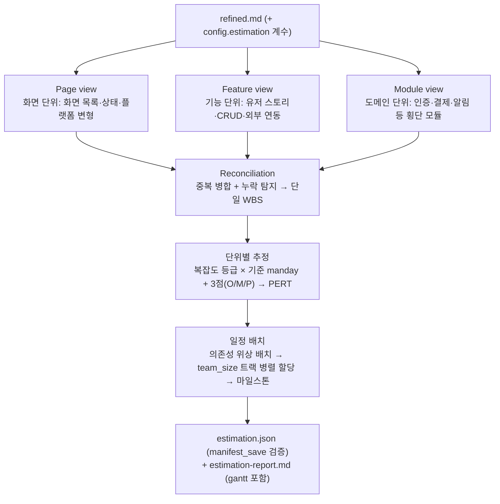

# Estimation — `estimate` 스킬 심층 설계

기획서만으로 "얼마나 걸리는가"에 답한다. 코드베이스는 읽지 않는다 — 추정의 입력은 `refined.md`와 config 계수뿐이며, 모든 가정은 산출물에 명시된다. 컨텍스트를 많이 쓰는 것이 허용된 스킬로, 무거운 작업 전체를 estimator 서브에이전트에 격리한다.

## 1. 프로세스

분해를 3개 관점에서 독립 수행한 뒤 교차 대조한다 — 한 관점이 놓친 작업을 다른 관점이 잡는 것이 3뷰의 존재 이유다.



### 1.1 3뷰 분해

| 뷰      | 단위              | 추출 대상                                                         |
| ------- | ----------------- | ----------------------------------------------------------------- |
| Page    | 화면(스크린)      | 화면 목록, 화면별 상태(빈/로딩/에러/성공), 반응형·플랫폼 변형     |
| Feature | 기능(유저 스토리) | CRUD 흐름, 검색·필터, 권한 분기, 외부 서비스 연동, 알림·메일      |
| Module  | 도메인·횡단 모듈  | 인증, 결제, 파일 처리, 관리자, 정책 엔진 등 화면에 안 보이는 기반 |

### 1.2 Reconciliation

- **중복 병합**: 같은 산출물을 만드는 작업은 1회만 집계 (예: "로그인 화면"(Page)과 "이메일 로그인"(Feature)은 하나의 unit으로 병합, `view_refs`에 양쪽 출처 기록).
- **누락 탐지**: 각 뷰에만 나타난 단위는 그대로 채택하되 `single_view` 플래그 — 리포트의 확인 요청 목록에 오른다.
- **결과**: 계층 없는 단일 WBS(unit 목록). 단위 규모가 XL을 넘으면 분해를 한 단계 더 내린다.

### 1.3 추정 — 복잡도 등급 + PERT

- 단위별 복잡도 `S/M/L/XL` 판정 → `config.estimation.complexity_baseline`의 기준 manday를 M(최빈값)으로 삼는다.
- 3점 추정: 낙관 O · 최빈 M · 비관 P (근거 문장 필수 — "외부 연동 스펙 미확정이라 P 가중" 등).
- PERT 기대값 `E = (O + 4M + P) / 6`, 표준편차 `σ = (P − O) / 6`.
- 롤업: `Σ E` → 오버헤드 가산(`overhead_ratio`: 통합·테스트·PM) → `buffer_ratio` 적용 = 최종 견적. 총 σ로 신뢰 구간(E ± 2σ) 병기.

### 1.4 일정 배치

- unit 간 의존성(선행 조건)을 기획서에서 추출해 위상 순서로 정렬.
- `team_size`개 트랙에 병렬 할당(의존 없는 unit은 동시 진행), `available_manday_per_week`로 주 단위 환산.
- 마일스톤: 모듈 경계·외부 연동 완료·전체 완료 지점에 배치. 리포트에 mermaid gantt로 렌더.

## 2. 산출물

### 2.1 `estimation.json` (type: estimation — manifest_save로 스키마 검증)

```jsonc
{
  "version": 1,
  "source": "refined.md",
  "config_used": { "team_size": 2, "buffer_ratio": 0.2, "...": "..." },
  "units": [
    {
      "id": "U-1",
      "name": "이메일 로그인",
      "view_refs": {
        "page": ["로그인 화면"],
        "feature": ["이메일 로그인"],
        "module": ["인증"],
      },
      "single_view": false,
      "complexity": "M",
      "estimate": { "o": 1.5, "m": 3, "p": 6, "expected": 3.25, "sigma": 0.75 },
      "rationale": "표준 인증 플로우이나 소셜 연동 스펙 미확정으로 P 가중",
      "deps": [],
    },
  ],
  "rollup": {
    "sum_expected": 42.5,
    "overhead": { "integration": 4.3, "test": 6.4, "pm": 2.1 },
    "buffered_total": 66.4,
    "confidence_interval": [55.1, 77.7],
  },
  "schedule": {
    "tracks": [{ "track": 1, "units": ["U-1", "U-3"] }],
    "milestones": [{ "name": "인증 모듈 완료", "week": 3 }],
    "total_weeks": 8,
  },
  "assumptions": ["소셜 로그인은 Google 1종만", "..."],
  "risks": [
    { "unit": "U-7", "risk": "외부 API 스펙 미확정", "impact": "high" },
  ],
}
```

### 2.2 `estimation-report.md`

사람이 읽는 리포트: 요약(총 manday·기간·신뢰 구간) → WBS 표(뷰 출처·복잡도·E±σ) → gantt → 가정 목록 → 리스크 상위 N → `single_view` 확인 요청. deilen preview로 바로 열람 가능한 형태를 유지한다.

## 3. Config — `config.estimation`

| 키                          | 기본값                                             | 의미                            |
| --------------------------- | -------------------------------------------------- | ------------------------------- |
| `team_size`                 | 2                                                  | 병렬 트랙 수                    |
| `available_manday_per_week` | 5                                                  | 1인 주당 가용 manday            |
| `complexity_baseline`       | `{ "S": 1, "M": 3, "L": 8, "XL": 20 }`             | 등급별 기준 manday (M값의 앵커) |
| `overhead_ratio`            | `{ "integration": 0.1, "test": 0.15, "pm": 0.05 }` | 합산 후 가산 비율               |
| `buffer_ratio`              | 0.2                                                | 최종 버퍼                       |

- user 계층에 팀 표준을, project 계층에 프로젝트 특성(신규팀 +buffer 등)을 둔다.
- setup 웹폼의 estimation 섹션에서 편집.

## 4. 원칙

1. **코드 미접근** — 추정 근거는 기획서 문장과 config 계수뿐. "기존 코드가 있으니 싸다" 류의 판단은 하지 않는다 (그 보정이 필요하면 개발자 사이드 도구의 몫).
2. **가정 전부 명시** — 기획서가 답하지 않은 것을 임의로 채우면 반드시 `assumptions`에 기록한다. 가정이 바뀌면 재추산이 전제.
3. **불확실성 표기** — 단일 숫자가 아닌 구간(E ± 2σ)으로 말한다. σ가 큰 단위는 리스크 목록에 자동 승격.
4. **재현 가능** — 같은 refined.md + 같은 config면 같은 구조의 WBS가 나와야 한다. estimator 프롬프트는 분해 규칙을 결정론적으로 기술한다.
