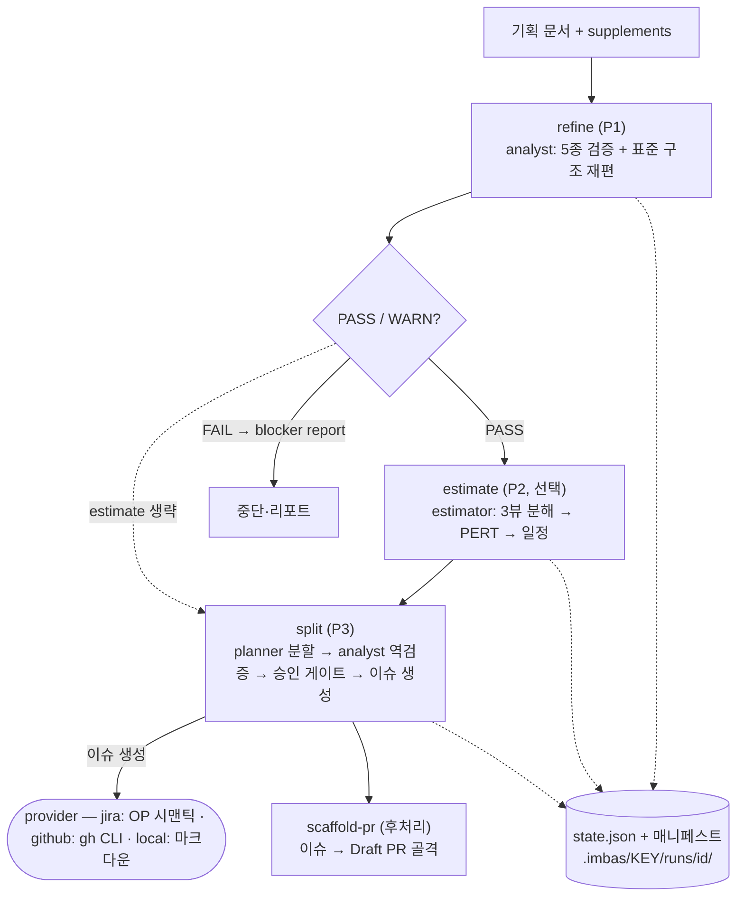

# Spec — 책임 분리 · 데이터 플로우 · v1→v2 델타

## 1. 정체

기획 문서(비정형)를 입력받아 기획자 관점의 산출물로 변환하는 파이프라인:

```
기획 문서
  → [refine]   재구조화 + 정합성 검증  → refined.md + validation-report.md
  → [estimate] 3뷰 분해 + manday 추산  → estimation.json + estimation-report.md   (선택 단계)
  → [split]    INVEST 분할 + 이슈 생성 → stories-manifest.json + provider 이슈
  → [scaffold-pr] 이슈 → Draft PR 골격                                            (후처리)
```

개발 관점 산출물(코드 기반 Subtask, EARS, 구현 DAG)은 v2에서 범위 밖이다. imbas는 "무엇을 얼마에 언제까지"까지 답하고, "어떻게 구현"은 개발 도구의 몫으로 넘긴다.

## 2. 책임 분리

| 기능                  | 스킬          | 에이전트  | MCP 의존                                  | 산출물                                  |
| --------------------- | ------------- | --------- | ----------------------------------------- | --------------------------------------- |
| 기획서 재구조화·검증  | `refine`      | analyst   | run_create/get/transition                 | refined.md, validation-report.md        |
| manday 추산·일정      | `estimate`    | estimator | run_get/transition, manifest_save/validate | estimation.json, estimation-report.md   |
| 이슈 분할·생성        | `split`       | planner, analyst | run_get/transition, manifest_save/validate | stories-manifest.json, provider 이슈 |
| 스캐폴드 PR           | `scaffold-pr` | —         | config_get                                | Draft PR (체크리스트 포함)              |
| 설정·캐시             | `setup`       | —         | config_get/set, open_settings             | config.json, cache/\*.json              |
| 이슈 요약             | `digest`      | —         | run_get, config_get                       | provider 코멘트/Digest 엔트리           |
| 진행 조회             | `status`      | —         | run_get/list                              | 상태 리포트                             |
| 전체 자동 실행        | `pipeline`    | (경유)    | run 4종 + manifest 2종                    | 위 단계 전체                            |
| 이슈 맥락 구조화      | `read-issue` (internal) | — | run_get, config_get                     | 구조화 JSON                             |

## 3. 데이터 플로우

phase 진행은 `state.json`(MCP 상태머신)이, 이슈 생성 진행은 매니페스트의 `issue_ref`/`status`가 기록한다 — 상태의 주소는 이 둘뿐이다.



- `pipeline`은 refine → estimate(생략 가능) → split을 게이트와 함께 연속 실행한다.
- `digest`·`read-issue`·`status`는 파이프라인 밖의 조회·정리 유틸리티다.

## 4. v1 → v2 델타

### 제거

| 대상                                          | 이유                                                             |
| --------------------------------------------- | ---------------------------------------------------------------- |
| `devplan` 스킬 + P3 phase                     | 개발자 사이드 (코드 탐색 기반 EARS Subtask)                      |
| `implement-plan` 스킬                         | 개발자 사이드 (구현 DAG 배치) — 일정 산출은 estimate가 흡수      |
| `engineer` 에이전트                           | devplan 전담이었음                                               |
| `cache` 스킬                                  | setup의 `refresh-cache` 서브커맨드로 흡수                        |
| Hook 4종 (setup·context-injector·pre-tool-use·agent-enforcer) | 전원 주입용 — 스킬 로드로 충분, 차단 기능 없었음 |
| MCP 8종 (ast 2, cache 2, manifest_get/plan/implement_plan, ping) | 개발자 사이드 소멸 + 파일 I/O 래퍼는 Read/Write로 대체 |
| `@ast-grep/napi` 의존성, `src/ast/`           | AST 도구 소멸                                                    |
| `libs/run.cjs`, `bridge/*.mjs` 훅 번들, `buildHooks.mjs` | 훅 소멸                                               |

### 신규·변경

| 대상                        | 내용                                                                  |
| --------------------------- | --------------------------------------------------------------------- |
| `refine` (validate 확장)    | 검증 리포트만 → **재구조화된 기획서(refined.md)** 를 함께 산출        |
| `estimate` + `estimator`    | 신규 — 3뷰(페이지/기능/모듈) 분해, PERT manday, 일정 산출             |
| `split` (split+manifest 통합) | 분할과 provider 생성을 승인 게이트를 사이에 두고 한 스킬로          |
| state phase                 | `validate/split/devplan` → `refine/estimate/split` (estimate는 skip 가능) |
| 매니페스트 type             | `stories/devplan/implement-plan` → `stories/estimation`               |
| `pipeline`                  | devplan 단계 제거, refine → estimate → split으로 재작성               |

### 유지

- provider 3종(`jira`/`github`/`local`)과 그 경계 규칙 (skill이 provider X 대상이면 `references/Y/**` 안 읽음)
- `[OP:]` 시맨틱 오퍼레이션 계층 (`.shared/operations/`) — Jira REST 의도만 기술, 실행 도구는 세션이 결의
- analyst·planner 에이전트, INVEST·3→1→2 검증, plan-then-execute 원칙
- `.imbas/<KEY>/runs/<id>/` 상태 구조, config user/project 2계층, 설정 웹 UI
- digest·read-issue·status 스킬

## 5. 비채택

| 항목                               | 근거                                                                       |
| ---------------------------------- | -------------------------------------------------------------------------- |
| estimate의 코드베이스 참조         | 순수 기획자 사이드 유지 — 추정은 기획서와 config 계수만으로. 코드 기반 보정이 필요해지면 별도 개발자 사이드 플러그인의 몫 |
| 이슈 생성 즉시 실행 (게이트 없이)  | plan-then-execute 유지 — 매니페스트 검토 없이 provider에 쓰지 않음         |
| MCP 완전 제거                      | 결정론적 상태머신·스키마 검증은 코드가 소유해야 신뢰 가능 (LLM 판단에 맡기지 않음) |
| Atlassian 도구 재내장              | 세션의 Atlassian 플러그인이 실행 계층 — imbas는 REST 의도(`[OP:]`)만 소유  |
