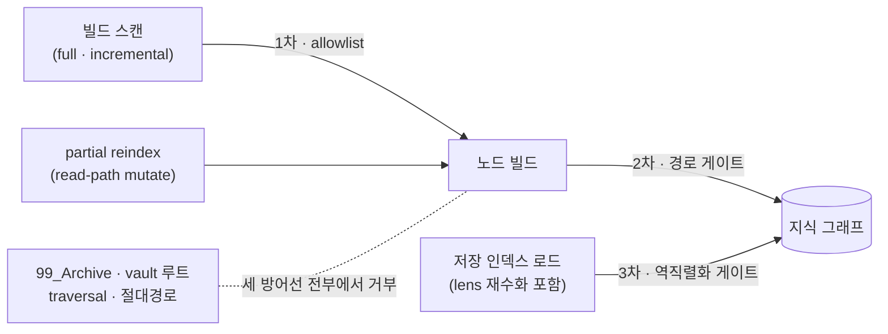
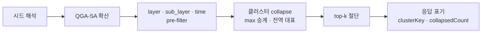

# maencof 서고·클러스터 최종 스펙 (2026-08-20)

그래프 외 서고와 경쟁 단위 교체 — 구현 완료 기준의 현행 계약 정리.

- **버전**: `@ogham/maencof` 0.13.0 · `@ogham/maencof-lens` 0.9.1
- **브랜치**: `maencof/archive-layer` (12 커밋, 작업 트리 클린)
- **요청서**: `maencof-archive-cluster-request-2026-08-19.md` (R1~R7) · **플랜**: rev.2 (3자 crosscheck `cleared`)
- **원칙**: 검색 소비자가 후보 전체를 읽는 LLM이므로, 목적함수는 상위 정밀도가 아니라 **토큰 예산 내 클러스터 커버리지**다.

---

## 1. 경쟁 스펙트럼 — 3계급

판정 기준은 "개별 항목이 질의 대상이 되는가".

| 계급 | 위치 | 경쟁권 | 메커니즘 |
| --- | --- | --- | --- |
| 간행물/원자료 | vault `99_Archive/` (서고) | **0표 — 그래프 밖** | 스캔 allowlist + 노드 게이트 + 역직렬화 게이트 (R1·R2) |
| 업무 에피소드 | L3/L4 + `cluster_key` | **스레드당 1표** | 검색 시 클러스터 collapse, max 승계 (R3·R4) |
| 정제 지식 | L1/L2 | 문서당 1표 | 현행 유지 |

부속 규칙: 증류 후 남는 `archived: true` 스텁은 시드 채널에서 **0.3배로 침강**한다 (R5).
vault 서고 `99_Archive/`와 시스템 보관소 `.maencof-meta/archive/`(만료 L4 정본, `archive_path`의 목적지)는 **별개 개념**이다.

---

## 2. 서고 계약 — 그래프 진입 3중 방어선 (R1·R2)

인덱싱 대상은 레이어 디렉토리 `01_Core` `02_Derived` `03_External` `04_Action` `05_Context` 다섯뿐이다. **유효한 frontmatter를 가진 문서라도 이 밖에 있으면 그래프에 들어가지 않는다** — 서고, vault 루트 문서, 미지의 디렉토리 전부.

어느 진입로로 와도 비레이어 경로는 같은 판정(`isLayerDirPath`)에 막힌다 — 스캔이 놓쳐도 노드 빌드가, 노드 빌드를 우회한 과거 인덱스는 로드가 거른다.



| 방어선 | 위치 | 막는 진입로 |
| --- | --- | --- |
| 1차 | 스캔 allowlist `VAULT_SCAN_LAYER_PATTERNS` (`constants/vaultScanner.ts`) | full/incremental 빌드 파일 수집. blocklist가 아니라 allowlist — 낯선 디렉토리도 새지 않는다 |
| 2차 | 노드 빌드 경로 게이트 `isLayerDirPath` (`types/layer.ts`) | partial reindex 등 스캔 외 노드 생성 경로 |
| 3차 | 역직렬화 게이트 (`deserializeGraph`·`deserializeShards`) | 변경 이전 인덱스의 잔존 노드, **lens 재수화** — 로드 시 비레이어 노드와 dangling edge를 정화하고 카운트 재계산 |

게이트 판정: `posix.normalize` 정규화 후 첫 세그먼트가 레이어 디렉토리인지 검사. **상향 탈출(`01_Core/../99_Archive/...`)·절대경로·대소문자 불일치는 거부**된다.

- **옵트아웃**: frontmatter 검증만 필요한 소비자(`read`/`update`/`move`/`delete`)는 `buildKnowledgeNode(doc, { allowNonLayerPath: true })`로 게이트를 우회한다 — 서고 문서는 여전히 명시 경로로 읽고 고칠 수 있다. 그래프에 넣지 않을 뿐이다.
- **부수 효과(의도됨)**: vault 루트의 유효 문서도 그래프에서 빠진다. 빌드 시 `99_Archive`발 파싱 실패 노이즈는 0건이 된다.
- **알려진 한계**: 레이어 디렉토리 안 심볼릭 링크가 서고를 끌어오는 경우는 lexical 게이트가 감지하지 못한다 (스캔 `followSymbolicLinks` 기본 false, 옵션을 켜는 호출자 없음 — 실측).

---

## 3. `cluster_key` — 스레드 선언 필드 (R3)

증분 기록물(메일·Jira·일정)이 자기 스레드를 선언하는 frontmatter 필드. **시드·태그 채널과 완전히 분리**되어 있다 — 시드 매칭에 섞이지 않는다.

```yaml
cluster_key: jira-gcc-3903        # 또는 works-mail-2026-08-19
```

- 스키마: `z.string().min(1).optional()` (`FrontmatterSchema`) → 노드 `clusterKey`로 전파, 직렬화 자동 왕복.
- 노출: `create` 입력 `cluster_key` · `update` 입력 `frontmatter.cluster_key`.
- 제거: 기존 `frontmatter.unset: ['cluster_key']` 경로 (보호 필드 아님).

---

## 4. 클러스터 collapse — 검색 의미론 (R4)

같은 스레드 문서 N건은 독립 증거가 아니라 **같은 사건의 반복 관측**이다. `query()` 내부(필터·path-exact 제외 후, top-k 절단 **전**)에서 같은 `clusterKey` 결과를 대표 1건으로 접는다 — `kg_search`·`kg_context`·평가 하네스가 전부 이 한 지점을 지나므로 세 소비자의 의미론이 갈라질 수 없다.



### 대표 선정과 점수

- **그룹 점수 = 활성 멤버의 max 승계** (sum 금지 — 합산은 수 프리미엄을 부활시킨다).
- **대표 = 활성 필터(layer/sub_layer/time)를 만족하는 그래프 전역 클러스터 멤버 중 `updated` 최신.** 검색에 활성화되지 않은 증류본도 최신이면 대표를 승계한다 — "증류본이 생기면 자동 대표 승계"의 문언 그대로. tie-break: `updated` 동일 → 활성 멤버 우선 → nodeId 사전순. `updated`가 YYYY-MM-DD가 아니면 `mtime` 파생 날짜로 비교.
- 전역 승계된 대표: `hops` = 활성 멤버 최소값, `trace` = 빈 배열 (SA 경로 비성립).
- `clusterKey` 없는 노드는 개별 경쟁 유지. 멤버 1건이어도 `clusterKey`는 표기(열기 질의용).

### 응답 표기

| 표면 | 표기 |
| --- | --- |
| `kg_search` 항목 | `clusterKey` + `collapsedCount`(이 응답에서 접힌 수, ≥1일 때만) |
| `kg_context` documents 모드 | 항목에 동일 2필드 |
| `kg_context` 조립 markdown | 헤더 라인에 `(+N collapsed · cluster: <key>)` — markdown만 받는 호출자도 열기 질의를 만들 수 있다 |

### 명시 열기 — `kg_search { cluster }`

접힌 클러스터의 전 멤버를 여는 열거 모드. `seed`와 **상호 배타** (둘 다/둘 다 없음 → error).

- SA 없이 해당 `clusterKey` 전역 멤버를 `updated` 내림차순(동률 시 path 사전순)으로 반환. score/hops = 0, `exploredNodes` = 0.
- `max_results`·`layer_filter`·`sub_layer`·`since/until`·`include_trace` **미적용**. `include_content`는 공용.
- 상한 `MAX_CLUSTER_ENUMERATION`(200) 절단 시 `truncated: true`. 응답에 `cluster`·`clusterSize`(전역 총원).

### 부수 개선 — `sub_layer` pre-filter 승격

기존에는 핸들러가 절단 **후** `sub_layer`를 걸러 `max_results` 미달이 생겼다. 이제 `QueryOptions.subLayerFilter`로 SA 후·collapse 전에 적용된다(쿼리 캐시 키 포함).

### lens 통과 (maencof-lens)

- `search` 도구에 `cluster` 파라미터 pass-through. collapse 표기는 `handleKgSearch` 통짜 반환으로 자동 전파.
- **레이어 상한 후필터**: maencof 열거 모드는 `layer_filter`를 받지 않으므로, lens가 열거 결과를 볼트 상한(기본 L2–L5)으로 걸러 **L1 문서가 lens로 새지 않는다**. `clusterSize`는 상한 필터 전 전역 총원.
- graph-null만 재색인 안내로 치환하고, maencof의 입력 검증 오류는 문구 그대로 전파.

---

## 5. archived 침강 (R5)

`archived: true` 스텁(증류 후 태그만 온전한 껍데기)의 점수에 `ARCHIVED_SEED_MULTIPLIER = 0.3`을 곱한다.

| 채널 | 적용 | 효과 |
| --- | --- | --- |
| 키워드 시드 (`resolveKeywordSeed`) | `score × idfScale × 0.3` | tag-exact 0.5 → 0.15 |
| `kg_suggest_links` 종합 점수 | `(tag + SA보너스) × 0.3` | 실측 P3 사례 0.4 → 0.12 < 기본 min_score 0.2 → 탈락 |
| path-exact / path-prefix 시드 | **미적용** | 직접 지목은 존중 |

`tag_score`/`sa_score` 원값 필드는 강등 없이 보고. 계수는 운영 실측 후 조정 여지를 상수 주석에 남김.

---

## 6. checkup 서고 참조 (R6)

레이어 문서에서 `99_Archive/` 경로로의 링크는 깨진 링크가 아니라 **서고 참조**다 — 대상은 정의상 그래프 노드가 아니므로, 디스크 존재로 판정해 정보성 `archive-reference`로 분류하고 D3 오류로 집계하지 않는다. 프롬프트 소유물(`agents/checkup.md` D3 예외 + `skills/checkup/reference.md` + `templates/rules/link-integrity.md` R2 예외)로 구현 — `DiagnosticCategory` 타입 불변.

---

## 7. 검증 (R7 + 수용 기준)

### 골든셋 (baseline 29쿼리, ndcg10 0.977 · recall10 0.9704 · mrr 1)

- `cluster-collapse-coverage`: 시드 `gcc-3903` — 스레드 8건이 접혀야 결정(L2)·인접 문서가 top-k에 남는다. 접힌 멤버는 등급 0이라 collapse 실패 시 nDCG가 무너진다.
- `cluster-digest-succession`: 시드 `jira` — 증류본(태그 얇음)은 활성화되지 않는다. **비활성 최신 멤버의 전역 대표 승계**를 직접 측정.
- 2단계 측정 규율: 픽스처 11건을 먼저 넣고 골든 27쿼리 불변(ratchet 게이트 활성) 상태로 eval 통과를 기계 증명한 뒤에야 골든 2케이스 + baseline 재기록을 같은 커밋으로.

### 수용 기준 대조 — 5/5 충족

| # | 기준 | 증거 |
| --- | --- | --- |
| 1 | 유효 frontmatter여도 `99_Archive` 그래프 미진입 | `archiveExclusion`(fullBuild) + `knowledgeNodePathGate` + `metadataStoreLayerGate`(재수화) |
| 2 | `99_Archive`발 파싱 실패 노이즈 0건 | 같은 통합 테스트 `parseFailures` 0 단언 |
| 3 | 같은 키 8건 → top-10 대표 1건 + 접힌 수 표기 | `queryCollapse`(collapsedCount 7) + 응답 계층 테스트 + 골든 coverage |
| 4 | archived 시드 후보 상위 배제 | `archivedDemotion` (0.4→0.12 재현) |
| 5 | 기존 골든셋 ratchet 통과 | (b1) 27쿼리 게이트-활성 eval 통과로 기계 증명 |

### 최종 체인

typecheck 전 워크스페이스 exit 0 · maencof **161 테스트 파일 pass** · eval 통과 · lens **16 파일 pass** · 훅 번들 가드(크기 상한·금지 모듈) 통과 · filid 구조 스캔 — 이번 변경발 신규 finding 0건. 전 신규 동작 fail-first(red 관측 → green).

---

## 8. API 변경 요약

| 표면 | 변경 |
| --- | --- |
| frontmatter | `cluster_key?: string` 신설 |
| `create` | 입력 `cluster_key` |
| `update` | 입력 `frontmatter.cluster_key` (제거는 `unset`) |
| `kg_search` 입력 | `seed` optional화 + `cluster` 신설 (정확히 하나 필수) |
| `kg_search` 응답 | 항목 `clusterKey?`/`collapsedCount?` · 응답 `cluster?`/`clusterSize?`/`truncated?` |
| `kg_context` 응답 | documents 항목 동일 2필드 · markdown `(+N collapsed · cluster: <key>)` |
| lens `search` | `cluster` pass-through (+상한 후필터) |
| 내부 | `QueryOptions.subLayerFilter` · `ActivationResult.clusterKey?/collapsedCount?` · `MAX_CLUSTER_ENUMERATION` · `ARCHIVED_SEED_MULTIPLIER` |

## 9. 범위 밖 후속 제안

- **SA 시드 단계의 수 증폭 캡**: 같은 클러스터 N건이 각각 시드 활성 질량을 갖는 증폭은 결과-레벨 collapse로는 남는다(리뷰에서 codex 지적, R4 문언 밖으로 판정). 차기 후보: `resolveSeedNodes`에서 동일 `clusterKey` 시드를 max 1건으로 캡.
- **강등 계수 0.3 튜닝**: 운영 실측 후 조정.
- **lens의 `clusterSize` 의미**: 상한 필터 전 전역 총원으로 두었다 — 상한 내 총원이 더 유용하면 후속 조정.
