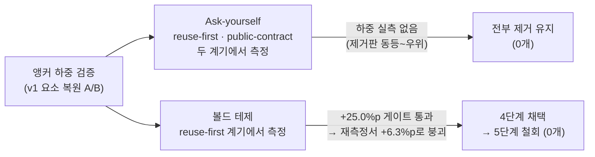

# rule-bench 3·4단계 결과 — 잔여 검증 완료와 규칙 문면 확정 (2026-08-02)

> 이 문서는 2026-08-02 세션의 새 작업만 담는다. 1·2단계를 포함한 전체 역사와 상세 표는 [2026-08-01-r2.md](./2026-08-01-r2.md)가 정본.

## 결론 먼저

1. **규칙 문면이 확정됐다**: 앵커(볼드 테제·Ask-yourself) 0개의 **순수 v2 압축본**. 총 57,651 → **43,511B(-24%)**, 상시 로드 -23%. 4단계에서 채택했던 reuse-first §1 볼드는 5단계 재측정으로 하중 증거가 무너져 철회했다(아래 5단계 절).
2. **압축 무회귀가 전 모델·전 이슈로 확정됐다**: opus는 10이슈 전부 규칙 유무와 무관하게 만점, 유일한 회귀 의혹(public-contract)은 n 확대에서 해소됐다.
3. **haiku의 규칙-준수는 확률적이다**: 1단계의 "규칙 100% vs 무규칙 0%"는 소표본 상방이었고, n 확대 후 격차는 크게 줄었다. 산문 규칙으로 약모델을 결정적으로 움직일 수 없다는 것이 이 배터리의 최종 결론.

## 규칙 문서에 실제로 일어난 변경 2건

| 변경 | 근거 | 크기 |
| --- | --- | --- |
| `reuse-first`의 마지막 Ask-yourself 1줄 제거 | 프로브 + n=10 변동성 측정의 이중 무해 증거 (제거판이 오히려 근소 우위) | −71B |
| `reuse-first` §1 도입 볼드 복원(4단계 채택) → **5단계 재측정으로 철회** | 채택 근거 +25.0%p가 동일-문면 재측정에서 +6.3%p로 붕괴 — Ask-yourself 제거와 같은 원칙(하중 증거 없으면 유지 안 함)을 대칭 적용 | +4B → 0 |

두 변경 모두 build:rules 해시 재주입 → seiri 159/159 → apply-rules-sync → 3면(templates / .claude/rules / AGENTS.md) 바이트 패리티까지 검증 완료.

## 앵커 실험이 답한 질문

"압축에서 지운 앵커(볼드 테제·Ask-yourself) 중 실제로 하중을 지는 것이 있는가?"

- **Ask-yourself**: reuse-first(3단계, n=10)에서도 public-contract(4단계, R2p)에서도 하중 증거 없음 — 표적을 직격하는 문장(`"Can I read the public surface without resolving a wildcard?"`)조차 게이트 미달.
- **볼드 테제**: reuse-first에서 현행 50% → 75%로 게이트를 정확히 통과해 채택. 단 n=8의 임계선 상 충족이라 통계적 확정은 아니며, 재검증이 후속 항목.

## 측정 결과 요약

### 잔여 런 51 (2단계 미완분 완료)

| 측정 | 결과 |
| --- | --- |
| opus iE~iJ 48런 | **전 셀 hidden 만점**(R0 포함) — 10이슈 전체 포화 확정, "opus 리프트 0" |
| sonnet iJ 보충 3런 | 전부 4/4 — 합산 R0 50% → R1 92% → R2 100%, 유일하게 남은 확실한 규칙 리프트 |
| iE finalMention (opus) | 규칙 없이도 8/8 전 런이 무관 기존 실패를 자발 언급 — 규칙은 이 행동의 필요조건이 아님 |

### haiku 변동성·고감도 (완전 준수율)

수치는 **완전 준수율** — hidden 오라클의 전 항목을 통과한 런의 비율. 높을수록 규칙을 준수했다는 뜻이다.

| 계기 | 무규칙 R0 | v1 R1 | 현행 v2 | 비고 |
| --- | --- | --- | --- | --- |
| iC (재사용) | 17% (1/6) | 54.5% (6/11) | 50% (5/10) | 1단계 "0% vs 100%"는 소표본 상방 — 격차 대폭 하향 |
| iK (배선 표지, 모범 형제 제거판) | 0% (0/3) | 0% (0/3) | 0% (0/3) | 완전 준수 전무(부분점수 4/9→4/9→5/9) — 어떤 산문도 표지를 거의 유도 못 함 |
| iL (배럴, wildcard 반모범판) | 0% (0/3) | 36.4% (4/11) | 12.5% (1/8) | 무규칙은 wildcard 관행을 그대로 미러링(준수 0). v1 우위 방향은 있으나 게이트 2회 미달 — 현행 유지로 **종결** |

### 4단계 A/B (변형 게이트, 사전 기준: 현행 대비 +25%p)

| 표적 | 변형 내용 | 변형 성적 | 판정 |
| --- | --- | --- | --- |
| public-contract (iL) | §2 볼드 테제 + 표적형 Ask-yourself 복원 | 25.0% (+12.5%p) | **기각** — 현행 유지 |
| reuse-first (iC) | §1 도입 볼드 테제 복원 | **75.0% (+25.0%p)** | **채택** — templates 반영 |

## 5단계 — 볼드 테제 전면 적용 A/B (같은 날 실행)

사용자 결정("전 규칙 적용 가능성을 검증해보자")에 따라, 현행 14종의 **모든 번호 절 첫 문장을 볼드 처리**한 변형 R2b(62개 절, 문장 추가 없이 `**` 삽입만, +248B)를 제작해 세 판별 계기에서 게이트했다. 사전 기준: iL ≥ 37.5% 또는 iC ≥ 75.0%(각 현행+25%p), 타 계기 −25%p 초과 퇴행 없음, iK 부분점수 비악화 — 세 항 전부 충족 시에만 채택.

| 계기 | 현행 기준선 | R2b (전면 볼드) | 기준 대비 |
| --- | --- | --- | --- |
| iL (배럴) | 12.5% (1/8) | **50.0% (4/8)** | **+37.5%p — 트리거 충족** |
| iC (재사용) | 50.0% (5/10) | 37.5% (3/8) | −12.5%p — 퇴행 가드 이내 |
| iK (표지, 부분점수) | 55.6% (5/9) | 41.7% (10/24) | **악화 방향 — 가드 위배** |

**판정: 기각 (templates 무변경).** 채택 조건은 세 항의 AND인데 iK 가드가 위배됐다 — 사전 기준은 실행 후 변경하지 않는다는 원칙대로 기계 적용했다. 단 두 가지를 정직하게 기록한다:

1. **iL의 강한 신호** — 전면 볼드가 iL에서 이 배터리 사상 최고 성적(50%)을 냈다. R2p(앵커 복원, 25%)·v1 전문(36.4%)보다 높다. 단, 이 배터리에서 n=8급 고점은 재측정마다 회귀했다(iC 100→50%, iL R1 67→25%, R2r 75→37.5%).
2. **4단계 R2r 채택이 무너졌다** — iC에서 R2b가 37.5%에 그쳤는데, reuse-first §1 볼드 문면은 R2r과 R2b가 동일하다. §1 볼드 포함 암을 결합하면 9/16(56.3%) vs 현행 50% — 채택 근거였던 +25%p가 +6.3%p로 수렴했다.

### 사후 결정 (판단 위임에 따른 실행)

- **R2r 철회 실행** — Ask-yourself 제거와 같은 원칙("실측 하중 증거 없으면 유지하지 않는다")의 대칭 적용. §1 볼드를 v2 평문으로 복귀(2,185→2,181B), 검증 체인 green(R3 패리티·해시 재주입·seiri 159/159·3면 패리티). **최종 문면 = 앵커 0개의 순수 v2 압축본.**
- **iL 재게이트 보류** — 소표본 고점의 반복 회귀 실측을 근거로 노이즈 추적을 중단. 재개 조건을 명시해 후속으로만 남김: n≥32 + iK를 대체할 판별력 있는 가드 계기.

## 남은 후속

- iL 전면-볼드 신호 재게이트 — **보류**. 재개 조건: n≥32, 판별력 있는 가드 계기로 iK 교체.
- 컴팩션·장기세션 체제의 메인세션 실측 — **보류(사용자 결정: 세션 비용 대비 부적합)**.
- iK가 드러낸 한계의 뜻: 배선 표지 행동은 규칙 문서 채널로는 약모델에 전달되지 않으므로(전 암 완전 준수 0), 리뷰 스킬·훅·filid 스캔 같은 도구 채널이 맡아야 한다 — 그 백로그로 이관.

## 검증과 워킹트리

최종 배터리 전부 green: 하네스 selftest **12/12** · seiri **159/159** · filid **956 passed**(7 skipped 기존) · 3면 바이트 패리티 **14/14**. 워킹트리 11항목(신규 이슈 iK·iL, arms R2p·R2r, 계획 2건, 규칙·동기화 산출, 문서 갱신, grade.mjs 정규식 수정)이 계획 파일 지도와 일치하며, **커밋·버전 범프·릴리즈는 미결(사용자 결정)**.
