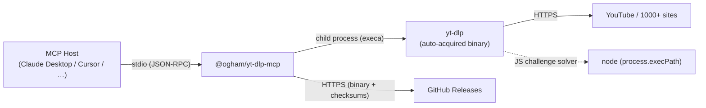
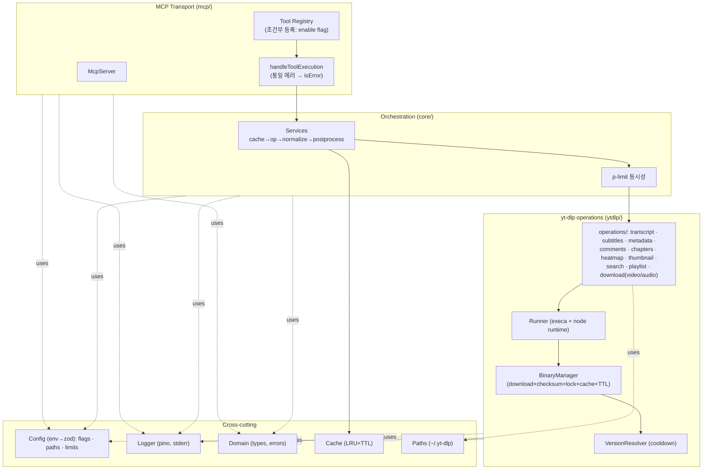
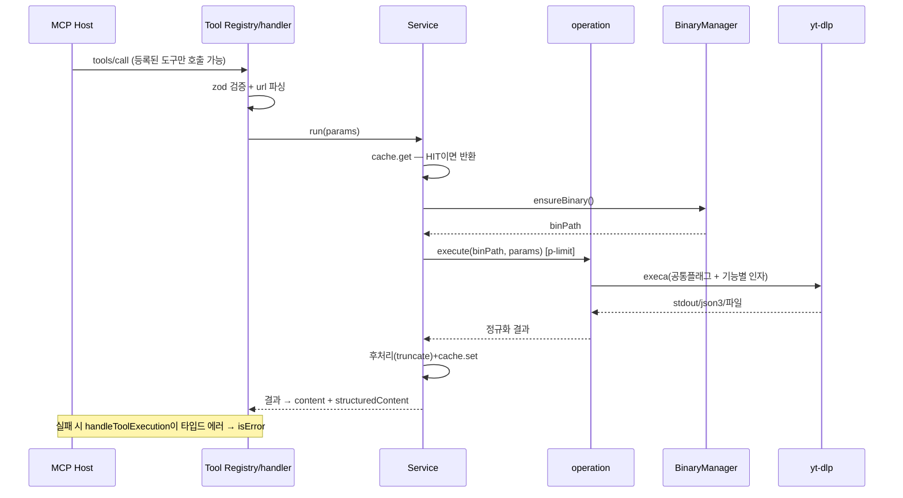
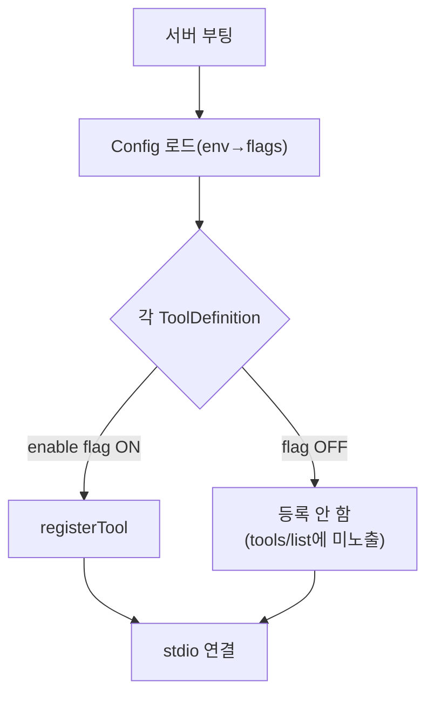
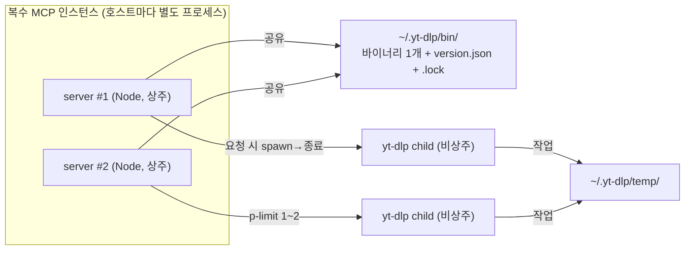

# ARCHITECTURE — @ogham/yt-dlp-mcp

> **설계 청사진.** "무엇을, 왜 이렇게 구성하는가"를 설명한다. 구현 순서/작업지시는 `PLAN.md`를, 실측 근거는 `poc/FINDINGS.md`를 참조.
> 대상: YouTube(및 yt-dlp 지원 플랫폼) 콘텐츠 추출·다운로드 MCP 서버.
> 범위: **yt-dlp 기능을 포괄 지원**(B). 기본은 최소, 나머지는 기능별 flag로 opt-in.
> 상태: 설계 확정 (핵심 경로 POC 검증). 작성 2026-06-08.

---

## 1. 시스템 개요

LLM/에이전트가 **셸 접근 없이** YouTube 영상의 자막·메타데이터·댓글·챕터 등을 얻고(추출), 필요하면 영상/오디오/썸네일을 받도록(다운로드) **MCP 툴**로 노출하는 서버. 엔진은 **yt-dlp standalone 바이너리**에 위임하되, 서버가 그 바이너리를 **자동으로 안전하게 확보**하여 사용자가 아무것도 따로 설치하지 않아도 **Windows/macOS/Linux에서 단독 동작**한다.

설계 철학 두 줄:

1. **포괄 지원, 최소 기본** — yt-dlp가 하는 일을 도구로 폭넓게 노출하되, 기본 활성은 5개. 모든 도구가 flag로 토글되며 나머지는 **flag를 켠 경우에만 도구로 등록**(미사용 시 LLM context 절약).
2. **엔진은 위임, 가치는 래퍼** — 자막/poToken 같은 복잡성은 yt-dlp에 맡기고, 우리는 *자동확보·안전·일관 계약·접근성*을 제공한다.



---

## 2. 설계 목표 & 제약 (품질 속성)

| #   | 목표                        | 동인                           | 검증                         |
| --- | --------------------------- | ------------------------------ | ---------------------------- |
| G1  | **단독 동작(zero-install)** | 셸 없는 호스트·일반 배포       | yt-dlp 미설치 상태 동작      |
| G2  | **크로스플랫폼**            | Windows 포함                   | OS별 asset 자동 선택         |
| G3  | **견고성**                  | poToken/봇차단                 | yt-dlp 위임 + JS런타임 주입  |
| G4  | **공급망 보안**             | 자동 바이너리 다운로드 위험    | cooldown + 체크섬(+서명)     |
| G5  | **안전성**                  | injection, 임의 실행, 파일 I/O | 옵션 화이트리스트, 경로 격리 |
| G6  | **유지보수성·확장성**       | yt-dlp 잦은 변경, 기능 다수    | 엔진 위임 + 도구 레지스트리  |
| G7  | **context 효율**            | 미사용 도구가 LLM 토큰 낭비    | 기능별 조건부 도구 등록      |
| G8  | **관측성·무증상 실패 방지** | stdio 디버깅                   | stderr 로깅, 타입드 에러     |

**비목표 (Non-goals)**: yt-dlp 로직의 JS 재구현(ADR-7), 인증 필요한 비공개 영상(쿠키 opt-in으로만). _(영상/오디오 다운로드는 이제 opt-in 기능으로 포함됨 — ADR-8.)_

---

## 3. 핵심 설계 결정 (ADR)

### ADR-1 — 자막/추출 엔진을 yt-dlp에 위임한다

- **맥락**: 2026-06 실측(`poc/FINDINGS.md`) — InnerTube `get_transcript`(수작업 protobuf), youtubei.js v17 `getTranscript()`, timedtext baseUrl **전부 실패**(HTTP 400 / 200-empty), 주거용 IP에서도. poToken/BotGuard가 원인.
- **결정**: yt-dlp 서브프로세스로 추출/다운로드.
- **근거**: yt-dlp가 nsig/poToken/JS challenge를 자체 해결하고 커뮤니티가 변경을 빠르게 추적.
- **결과**: 엔진 churn 외부 위임. 대가는 외부 바이너리 의존(ADR-2로 완화).

### ADR-2 — yt-dlp 바이너리를 런타임에 자동 확보한다 (시스템 설치 금지)

- **결정**: OS/arch별 PyInstaller standalone(`yt-dlp.exe`/`yt-dlp_macos`/`yt-dlp_linux[_aarch64]`)을 첫 사용 시 온디맨드 다운로드 후 공유 캐시.
- **근거**: `brew/pip/winget` 요구는 셸 없는 호스트·Windows에서 단독 동작을 깸. standalone은 Python 불필요. 번들(패키지 포함)은 100MB+로 npx 비대 → 온디맨드가 최적.
- **결과**: zero-install + 경량 배포. 대가는 첫 호출 지연(1회)·공급망 표면(ADR-4).

### ADR-3 — JS 챌린지 런타임으로 MCP 자신의 Node를 주입한다

- **결정**: `--js-runtimes node:${process.execPath}`.
- **근거**: MCP는 이미 Node 위에서 돈다. deno 등 추가 설치 0. (실측: deno 없이 자막 됐고, node 주입으로 nsig 경고 제거)

### ADR-4 — 공급망 방어: cooldown + 체크섬 (+선택 서명)

- **결정**: `releases/latest` 직행 금지. releases API에서 **발행 후 N일(기본 7) 지난 최신**만 채택, 같은 릴리스의 `SHA2-256SUMS`로 무결성 검증, 여유 시 `.sig`(PGP) 검증. `YTDLP_PINNED_VERSION`으로 완전 고정 가능.
- **근거**: cooldown은 악성 릴리스가 발견·철회될 시간을 번다. yt-dlp는 `published_at`·체크섬·서명 제공(확인됨).

### ADR-5 — 셸 직접 호출이 아니라 MCP로 감싼다

- **근거**: 타겟이 셸 없는 호스트/배포. (1) 셸 없는 호스트는 MCP 툴이 유일 통로 (2) injection 방어(옵션 화이트리스트) (3) 검증된 플래그·파싱 캡슐화 (4) `npx` 배포·재사용.

### ADR-6 — 위험·인증 기능은 opt-in (회피 기술 포함)

- **결정**: 쿠키(`--cookies-from-browser`)·프록시는 **기본 OFF**, 명시적 설정으로만. 파일을 쓰는 다운로드 계열도 opt-in(ADR-8).
- **근거**: ToS/법적 리스크(스크래핑·DMCA §1201 동향), 디스크·파일 I/O 부작용. 기본 비활성 + 문서 고지로 책임 경계.

### ADR-7 — yt-dlp 로직을 JS로 포팅하지 않는다

- **맥락**: `~/Workspace/yt-dlp` 실측 — youtube extractor 11k+ LOC, `jsinterp.py` 971 LOC, `pot/`·`jsc/`.
- **결정**: 재구현하지 않고 바이너리를 오케스트레이션. 소스는 이해/디버깅 참고.

### ADR-8 — 포괄 지원 + 최소 기본 + 기능별 조건부 도구 등록 ★ (이번 핵심)

- **맥락**: yt-dlp는 기능이 많다(자막/메타/댓글/챕터/heatmap/썸네일/검색/플레이리스트/다운로드…). 모두 항상 노출하면 LLM이 보는 tool list가 비대해져 **context 낭비**, 일부는 부작용(파일 쓰기)·법적 리스크.
- **결정**: 도구를 **레지스트리**로 정의하고, **기본값은 `constants/tool-defaults.ts`가 결정**(기본 on 5개), 나머지는 **각 기능별 환경변수 flag로 토글**해 켜졌을 때만 `registerTool` 호출. 꺼두면 `tools/list`에 아예 안 나타남.
- **근거**: "yt-dlp 기능 포괄 지원"과 "context/안전 최소주의"를 동시에 만족. 사용자가 필요한 기능만 켜서 가벼운 surface 유지. 새 기능 추가 = 레지스트리 엔트리 추가(확장성, G6).
- **대안**: 단일 `tools/call`에 `action` 파라미터로 분기 → LLM이 쓰기 어렵고 description 비대(기각). 전부 always-on → context 낭비(기각).
- **결과**: 도구 수는 가변(기본 4 ~ 전체 14+). §7 카탈로그 참조.

### ADR-9 — 작업/캐시 디렉토리는 `~/.yt-dlp/` 단일 트리

- **결정**: 보편적 `.cache` 대신 **전용 `~/.yt-dlp/`** 루트(`YTDLP_HOME`로 오버라이드). 하위: `bin/`(바이너리·메타·lock), `temp/`(임시 작업, 자동 정리), `downloads/`(다운로드 산출물).
- **근거**: 소유·식별 명확, 정리·백업 용이, 여러 데이터 종류를 한 트리에서 관리. §8 참조.

---

## 4. 컴포넌트 아키텍처



### 컴포넌트 책임

| 컴포넌트                          | 책임                                                          | 경계(비책임)            |
| --------------------------------- | ------------------------------------------------------------- | ----------------------- |
| **Tool Registry**                 | 도구 정의 목록 보유, config flag에 따라 조건부 `registerTool` | 비즈니스 로직 없음      |
| **handleToolExecution**           | 공통 에러→`isError`, character-limit truncation               | —                       |
| **Services**                      | op 오케스트레이션(캐시·동시성·정규화·후처리)                  | yt-dlp 호출 디테일 모름 |
| **operations/**                   | 기능별 yt-dlp 인자 구성·실행·파싱(transcript, …, download)    | 캐시/MCP 모름           |
| **Runner**                        | execa 호출(공통 플래그: `--js-runtimes node`, 타임아웃)       | 기능별 로직 없음        |
| **BinaryManager/VersionResolver** | 안전버전 선택·다운로드·체크섬·lock·캐시·TTL                   | 추출 안 함              |
| **Paths**                         | `~/.yt-dlp` 하위 경로 해석·생성·정리                          | —                       |
| **Config**                        | env→검증 불변 설정(flags/paths/limits)                        | 부작용 없음             |

**의존성 방향**: Transport → Core → ytdlp → (Domain/Config/Logger/Paths). 안쪽은 바깥을 모름 → operation을 가짜로 주입해 Service 단위테스트 가능.

---

## 5. 데이터 흐름

### 5-1. 도구 호출 (예: transcript)



### 5-2. 부팅 시 조건부 도구 등록 (ADR-8)



### 5-3. ensureBinary (공급망 안전 + 동시성) — §3 ADR-4

`캐시 유효? → (만료/없음) lock → cooldown 버전 선택 → asset+SHA2-256SUMS 다운로드 → SHA-256 검증(불일치 폐기) → atomic rename + chmod + meta 기록 → unlock`.

---

## 6. 모듈 경계 & 인터페이스 계약

### 6-1. 도메인 타입(발췌)

```ts
interface TranscriptSegment {
  text: string;
  startMs: number;
  durationMs: number;
}
interface VideoMetadata {
  videoId: string;
  title: string;
  channel: string;
  viewCount?: number;
  durationSec?: number;
  uploadDate?: string;
}
interface Chapter {
  title: string;
  startMs: number;
  endMs?: number;
}
interface HeatmapSpan {
  startMs: number;
  endMs: number;
  score: number;
} // most-replayed
interface CommentNode {
  id: string;
  text: string;
  author: string;
  likeCount?: number;
  parent?: string;
  depth: number;
  replies?: CommentNode[];
}
interface DownloadResult {
  path: string;
  bytes: number;
  format: string;
} // 파일 산출물
```

### 6-2. 포트(인터페이스)

```ts
interface BinaryManager {
  ensureBinary(signal?: AbortSignal): Promise<string>;
} // 동시 호출 안전(lock)
interface VersionResolver {
  resolveSafeVersion(
    cooldownDays: number,
  ): Promise<{ tag: string; assetUrl: string; sumsUrl: string }>;
}
interface Runner {
  run(
    binPath: string,
    args: string[],
    opts?: { timeoutMs?: number; signal?: AbortSignal },
  ): Promise<{ stdout: string }>;
}

// 도구 레지스트리 계약 (ADR-8의 핵심)
// EnableKey는 constants/tool-defaults.ts의 TOOL_DEFAULT_ENABLED 키에서 파생(도구당 1개).
type EnableKey = keyof typeof TOOL_DEFAULT_ENABLED;
interface ToolDefinition {
  name: string; // 예: 'ytdlp_get_comments'
  enabledBy: EnableKey; // 도구별 flag (모든 도구가 가짐)
  register(server: McpServer, deps: Deps): void; // zod 스키마·핸들러 등록
}
// 부팅: for (t of TOOL_REGISTRY) if (config.enable[t.enabledBy]) t.register(server, deps);
```

### 6-3. 에러 taxonomy (무증상 실패 금지)

`INVALID_INPUT · NO_CAPTIONS · VIDEO_UNAVAILABLE · AGE_RESTRICTED · BLOCKED · RATE_LIMITED · BINARY_UNAVAILABLE · CHECKSUM_MISMATCH · DOWNLOAD_FAILED · TIMEOUT · NETWORK · UNKNOWN` (retriable: RATE_LIMITED/NETWORK/TIMEOUT). yt-dlp stderr → 코드 매핑.

### 6-4. yt-dlp 호출 불변식 (`PLAN §11` 연동)

- 항상: `--js-runtimes node:${process.execPath}`, `--no-warnings`, `--ignore-config`.
- 추출(파일 안 남김): `--skip-download` + (자막 시) `--no-simulate --print` + `--write-subs … --sub-format json3` → temp에서 처리, `finally` 정리.
- `--dump-single-json`은 simulate를 켜 `--write-subs`를 무력화 → 자막+메타 동시 획득엔 `--no-simulate --print` 사용.
- 다운로드: 출력은 `~/.yt-dlp/temp`에서 작업 후 `downloads/`로 이동. `--exec` 등 임의 실행 옵션 **절대 비노출**.

---

## 7. MCP 도구 카탈로그 & 기능 토글 (ADR-8)

> **기본 5개**(search·list*subtitle_languages·transcript·metadata·playlist)는 env 미설정 시 등록. 모든 도구는 `YTDLP_ENABLE*<TOOL>=1/0`으로 켜고 끄며, 기본값은 `constants/tool-defaults.ts`가 정의.

| 도구                               | 기능                                  | 기본값 | 부작용/주석           |
| ---------------------------------- | ------------------------------------- | ------ | --------------------- |
| `ytdlp_search_videos`              | 키워드 검색(페이지네이션·날짜필터)    | **ON** | readOnly              |
| `ytdlp_list_subtitle_languages`    | 가용 자막 언어/형식                   | **ON** | readOnly              |
| `ytdlp_download_transcript`        | 깨끗한 자막 텍스트(타임스탬프 옵션)   | **ON** | readOnly              |
| `ytdlp_get_video_metadata`         | 메타데이터(JSON, 필드 선택)           | **ON** | readOnly              |
| `ytdlp_get_playlist`               | 플레이리스트 항목(+채널 영상목록)     | **ON** | readOnly              |
| `ytdlp_get_video_subtitles`        | 원본 자막(VTT/json3, 타임스탬프 보존) | off    | readOnly              |
| `ytdlp_get_video_metadata_summary` | 사람이 읽는 메타 요약                 | off    | readOnly              |
| `ytdlp_get_comments`               | 댓글(flat/threaded/markdown_tree)     | off    | readOnly              |
| `ytdlp_get_comments_summary`       | 댓글 요약                             | off    | readOnly              |
| `ytdlp_get_chapters`               | 챕터(구간 목차)                       | off    | readOnly              |
| `ytdlp_get_heatmap`                | most-replayed 구간(시청 히트맵)       | off    | readOnly              |
| `ytdlp_get_thumbnail`              | 썸네일 **다운로드**                   | off    | 파일 생성(¬readOnly)  |
| `ytdlp_download_video`             | 영상 다운로드(해상도·트리밍)          | off    | 파일 생성·¬idempotent |
| `ytdlp_download_audio`             | 오디오 추출 다운로드                  | off    | 파일 생성             |

- **공통**: `registerTool({title, description(Args/Returns/Use when/Don't use/Error), inputSchema(zod), annotations})`, 모두 `handleToolExecution` 경유, `openWorldHint: true`.
- **확장**: 새 yt-dlp 기능(예: `ytdlp_list_formats`, `ytdlp_get_channel`)은 `TOOL_DEFAULT_ENABLED` 엔트리 + `ToolDefinition` + `TOOL_REGISTRY` 등재만으로 편입(G6).
- **편의 묶음 옵션**: 모든 도구는 `YTDLP_ENABLE_<TOOL>=1/0`으로 개별 토글하며, `YTDLP_ENABLE_ALL=1`은 전체 on(개별 플래그 무시).

---

## 8. 디렉토리 레이아웃 (`~/.yt-dlp/`, ADR-9)

```
$YTDLP_HOME            # 기본 ~/.yt-dlp  (XDG 무시, 전용 트리)
├── bin/               # yt-dlp 바이너리 + version.json(tag·downloadedAt) + .lock
├── temp/              # 모든 임시 작업(자막 json3 추출, 다운로드 중간물) — 작업 후 자동 정리
└── downloads/         # download_video/audio/thumbnail 최종 산출물
                       #   (YTDLP_DOWNLOADS_DIR로 오버라이드 가능)
```

- **추출 도구**: `temp/`의 mkdtemp에서 처리 → 텍스트만 반환 → `finally` 삭제(파일 미잔존).
- **다운로드 도구**: `temp/`에서 받고 완료 시 `downloads/`로 이동, 경로 반환.
- **바이너리**: 인스턴스 간 `bin/` 공유(1개), lock으로 동시 다운로드 1회화.
- 모든 경로는 `Paths` 컴포넌트가 단일 책임으로 생성/해석/정리.

---

## 9. 운영 아키텍처



- **메모리**: 서버는 인스턴스당 상주 Node. yt-dlp는 요청 시 spawn→종료(비상주, peak ~100–150MB). `p-limit`로 동시 child 1–2개.
- **디스크**: 바이너리 공유 1개(≈35MB). temp는 작업 후 정리. downloads만 누적(사용자 관리).
- **동시 기동 race**: lock으로 다운로드 1회화.
- **업데이트**: `version.json` TTL(`REFRESH_DAYS`) 만료 시 갱신 + 추출 실패(봇차단/포맷) 트리거 갱신.
- **결과 캐시**: `{tool, videoId, args}` 키 LRU+TTL(자막·메타는 길게, 다운로드는 캐시 안 함).

---

## 10. 보안 아키텍처

| 위협                | 방어                                                                         |
| ------------------- | ---------------------------------------------------------------------------- |
| 공급망(악성 릴리스) | cooldown(7일) + `SHA2-256SUMS`(+선택 `.sig`) + `PINNED_VERSION`              |
| Prompt injection    | 툴은 화이트리스트 인자만 수용, yt-dlp 플래그는 서버 고정, `--exec` 등 비노출 |
| 임의 파일 쓰기      | 출력은 `~/.yt-dlp/{temp,downloads}`로 격리, 경로 traversal 차단              |
| 공격 표면 최소화    | **미사용 도구 미등록(ADR-8)** — 켠 기능만 노출                               |
| stdout 오염         | 로깅 stderr 전용(JSON-RPC 무결성)                                            |
| 비밀 유출           | 쿠키/토큰/전체 자막 기본 로깅 제외                                           |
| ToS/법적            | 쿠키·프록시·다운로드 opt-in + 문서 고지(스크래핑/DMCA §1201)                 |

신뢰 경계: 호스트/서버(신뢰) ↔ [경계] ↔ yt-dlp/대상사이트(비신뢰). 비신뢰 출력은 경계에서 파싱·검증 후 도메인 타입으로만 통과.

---

## 11. 외부 의존성 & 통합점

| 통합점          | 프로토콜                                     | 결합도 완화                                 |
| --------------- | -------------------------------------------- | ------------------------------------------- |
| MCP Host        | stdio JSON-RPC (`@modelcontextprotocol/sdk`) | 원격 시 Streamable HTTP로 트랜스포트만 교체 |
| GitHub Releases | HTTPS(releases API + asset + SUMS)           | Version/BinaryManager에 격리                |
| yt-dlp          | child process(execa), 플래그 계약(§6-4)      | Runner/operations에 격리                    |
| 대상 사이트     | (yt-dlp 내부)                                | 직접 접촉 안 함                             |
| Node 런타임     | `process.execPath` 주입                      | ADR-3                                       |

---

## 12. 품질 속성 달성 매핑

- 이식성(G1/G2) ← ADR-2 + ADR-3
- 견고성(G3) ← ADR-1 + TTL/실패 트리거(§9)
- 공급망·안전(G4/G5) ← ADR-4 + 화이트리스트·경로격리(§10)
- 유지보수·확장(G6) ← ADR-1/7 + 도구 레지스트리(ADR-8) + 플래그 단일지점
- context 효율(G7) ← 조건부 등록(ADR-8)
- 관측성(G8) ← stderr + 타입드 에러 + warnings
- 테스트 가능성 ← 포트 인터페이스(§6-2) 가짜 주입, json3/releases fixture(`PLAN §10`)

---

## 13. 향후 확장점

- **도구 추가**: `ytdlp_list_formats`, `ytdlp_get_channel`, `ytdlp_get_live_status` 등 — 레지스트리 엔트리 + `EnableKey`만 추가.
- **STT 폴백**: 자막 없는 영상 → `download_audio` → Whisper(opt-in). operations에 stt 추가.
- **트랜스포트**: 원격/멀티유저 시 Streamable HTTP(SSE deprecated).
- **캐시 백엔드**: LRU → SQLite/Redis(대규모), Cache 인터페이스만 교체.

---

## 부록 — 참조

- 실측: `poc/FINDINGS.md`(probe1~6 + yt-dlp 성공), 검증 코드 `poc/src/ytdlp/`
- 작업지시/DoD: `PLAN.md`
- 설계 배경: `current-implementation-analysis.md`, `improvement-options-2026.md`
- 참고 구현: `@kevinwatt/yt-dlp-mcp`(`~/Workspace/yt-dlp-mcp`) — 차용: `ytdlp_` 프리픽스·`handleToolExecution`·character limit·comments(flat/threaded/markdown_tree)·search·fixture / 차별점: 바이너리 자동확보(안전버전+체크섬)·node 주입·json3·조건부 도구 등록(ADR-8)·`~/.yt-dlp` 트리
- yt-dlp 소스(이해용): `~/Workspace/yt-dlp` (extractor 11k+ LOC, jsinterp 971 LOC, pot/jsc)
