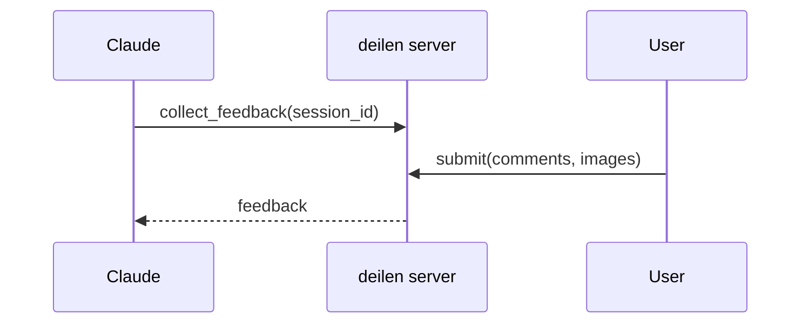

# Visuals in a previewed document

The viewer renders Mermaid diagrams, KaTeX math, and highlighted code as lazy browser assets, so the page carries structure a terminal transcript cannot. Default to showing a relation; write it out in prose only when a diagram would distort it.

## Reach for a diagram when the passage names relations

| The passage is about                             | Use                                     |
| ------------------------------------------------ | --------------------------------------- |
| Messages or handoffs between actors, over time   | `sequenceDiagram`                       |
| Components, dependencies, data flow, a pipeline  | `flowchart LR`                          |
| Decision logic and its branches                  | `flowchart TD` with `{condition}` nodes |
| Lifecycle, status transitions, retry paths       | `stateDiagram-v2`                       |
| Entities and how they relate                     | `erDiagram`                             |
| Types, interfaces, inheritance                   | `classDiagram`                          |
| Phases, milestones, durations                    | `gantt`                                 |
| Parts of one whole, up to ~6 slices              | `pie`                                   |
| Chronology of events                             | `timeline`                              |
| A concept broken down, options fanning out       | `mindmap`                               |
| Branch and merge history                         | `gitGraph`                              |
| A two-axis trade-off (risk/effort, cost/benefit) | `quadrantChart`                         |

Measured numbers — benchmarks, coverage, timings, distributions — belong in a plot you actually generate (matplotlib, R, Vega) and embed as ``; that keeps the data faithful and the axes honest. Mermaid's `xychart` draws only a simple bar or line series, so reach for it just when generating an image is not an option.

Four more are just as safe when the shape genuinely fits: `ishikawa` (several causes converging on one effect), `sankey` (a flow whose volumes are the point), `treemap` (nested proportion), and `journey` (a path with a satisfaction reading per step).

## Keep prose where prose is better

A diagram earns its place by removing a paragraph. Skip it for a single fact, a two-item comparison, a flat list of three items, or anything a short table states exactly — and never place a diagram next to a list that already says the same thing. One of the two should go.

## Sizing and framing

- One question per diagram. Past roughly 12 nodes or 7 lifelines, split by layer or phase rather than shrinking labels.
- Lead with a sentence that states the takeaway ("retries live on the transport path only"), then the diagram. The point then survives even when the diagram does not render.
- Name nodes with domain words instead of `A`/`B`: the fenced source is what a reader sees whenever rendering is off or broken. Prefer a non-reserved id plus a quoted label when the domain word is a Mermaid keyword — e.g. `interp["interpolate"]`, not a bare `interpolate` node id.

## Viewer constraints

- Mermaid runs in the browser with `securityLevel: "strict"` — `click` interactions are disabled and HTML tags in labels are encoded rather than rendered, except `<br/>`, which mermaid always treats as a line break. Keep labels plain text, and quote any label with punctuation: `auth["Auth: token exchange"]`.
- Flowchart **reserved node ids** (bare id fails to parse against the bundled mermaid): `interpolate`, `end`, `graph`, `subgraph`, `style`, `linkStyle`, `class`, `classDef`, `flowchart`. Safe-looking words such as `normalize`, `default`, `click`, `call`, and `href` currently parse as ids — still prefer a descriptive id + quoted label when unsure. The lock test re-checks this list against whatever mermaid is installed.
- The theme sets the label color (`#eee` dark, `#333` light), so a bare `fill:` repaints the box and leaves the text behind — that is the pale-on-pale node. Default to no color: carry emphasis with shape, `subgraph` grouping, or edge style.
- When color must carry meaning, pick it by lightness, not hue: a pale fill with a dark `color:`, or a deep fill with a light one, judged at 4.5:1 against each other rather than against the page. The mid-range takes neither ink — sky blue, mint, saturated pastels. Notation is a hex value or a CSS color name and nothing else (`classDef risk fill:midnightblue,color:white`); `hsl()`, `rgb()`, and `var()` fail to parse, and `pie` takes no `classDef` at all.
- A syntax error replaces the diagram with a `diagram failed to render` badge, leaving the source visible — so favor a type you can write correctly over the one that fits in theory, and run the pre-render parse gate in the preview skill before the user sees the page.
- The `-beta` suffix is the stability signal: a keyword that only parses with it is still moving between minor releases. Currently that covers `radar-beta`, `swimlane-beta`, `cynefin-beta`, `railroad-beta`, `venn-beta`, `treeView-beta`, and `wardley-beta` — keep them out of a document that has to render. `block`, `packet`, `sankey`, `xychart`, and `ishikawa` have graduated far enough to parse either way.
- The user can turn the Mermaid renderer off in `/deilen:setup`, in which case the fenced source stays on the page as text — one more reason for readable labels.
- A diagram is a single comment anchor; the user cannot point inside it. One point per diagram keeps their feedback unambiguous.
- Math renders through KaTeX (`$…$`, `$$…$$`) and code fences highlight from their language tag — use both instead of ASCII-art formulas or untagged fences.

## The shape of a good block

Takeaway sentence, diagram, then only the detail the diagram cannot carry:

````markdown
Feedback returns on a single long-poll — the viewer never asks twice.



The wait is bounded by `collect_timeout_seconds`; an elapsed wait returns `pending` rather than an error.
````
